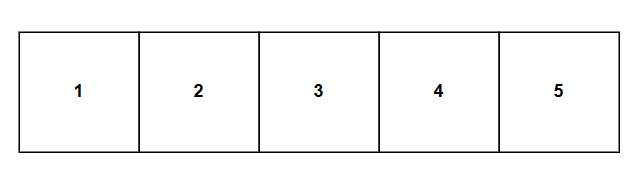
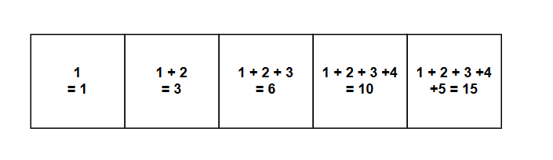

# 누적합

누적합은 배열의 각 원소에 대해 이전 원소들에 대한 합을 미리 구해서 배열에 미리 저장하고 이 값을 이용하여 구간의 합을 구하는 방법입니다.  예를 들어 다음과 같은 배열이 있고, 이 배열의 특정 구간인 합을 구하고 싶습니다. 



예시로,  배열의 1번째부터 3번째까지의 원소의 합을 구한다고 가정하겠습니다. 일반적인 방법이라면 위 배열을 `A` 라고 할때  배열원소인 `A[1]` 부터 `A[3]` 까지 for 문을 통해 각각의 배열의 원소의 합을 구하려고 할것입니다.

```java
A = [1, 2, 3, 4, 5]
sum = 0
for(int i = 1 ; i < 3; i ++) {
    sum += A[i];
}
// sum = 2 + 3 + 4 = 9
```

하지만, 이런식으로 구하게 되면 배열의 원소가 커지고 이에따라 구할 수 있는 구간의 합이 늘어난다면, 구하려는 구간의 배열의 크기에 따라서 구간의 합을 구하기 위해 $O(n)$ 시간복잡도가 걸립니다. 하지만 누적합을 이용한다면 $O(1)$ 시간복잡도로 **구하려는 배열의 구간의 길이와 상관없이** 구간의 합을 구할 수 있습니다. 

이를 위해서 먼저 다음과 같이 처음부터 0번째부터 i번째 누적된 합을 배열 `S[i]` 에 미리 저장해놓습니다.   




여기서, 1번째 부터 3번째까지의 원소의 합을 구하고 싶다면 2, 3, 4 번째 원소를 일일이 하나씩 더하는 것이 아니라 누적합 배열 `S`에서 `S[3] - S[0]` 를 하면 한번에 1번째 부터 3번째 구간의 원소들의 합을 구할 수 있습니다. 이를 일반화 하면 배열 `A`의 구간 `j` 부터 `i` 까지의 원소들의 합을 구할때 누적합 배열 `S` 를 이용하여 `S[i] - S[j-1]` 을 구하면 됩니다. 이를 수식으로 나타내면 다음과 같습니다.
$$
A[j]+...+A[i] = S[i]-S[j-1], (j<=i)
$$
 

위 수식에서 볼 수 있듯이, 구하려는 합의 구간의 길이가 늘어난다 하더라도 누적합 배열을 활용한 수식에는 인덱스만 달라지고 길이 자체는 달라지지 않음을 알 수 있습니다.  누적합 배열을 저장하는 방법은 다음과 같습니다.

```java
A = [1, 2, 3, 4, 5]
S = [0, 0, 0, 0, 0]
S[0] = A[0]
    
for(int i = 1; i < A.length; i ++) {
    S[i] = S[i - 1] + A[i];
}
printArray(S) // [1, 3, 6, 10, 15]
```