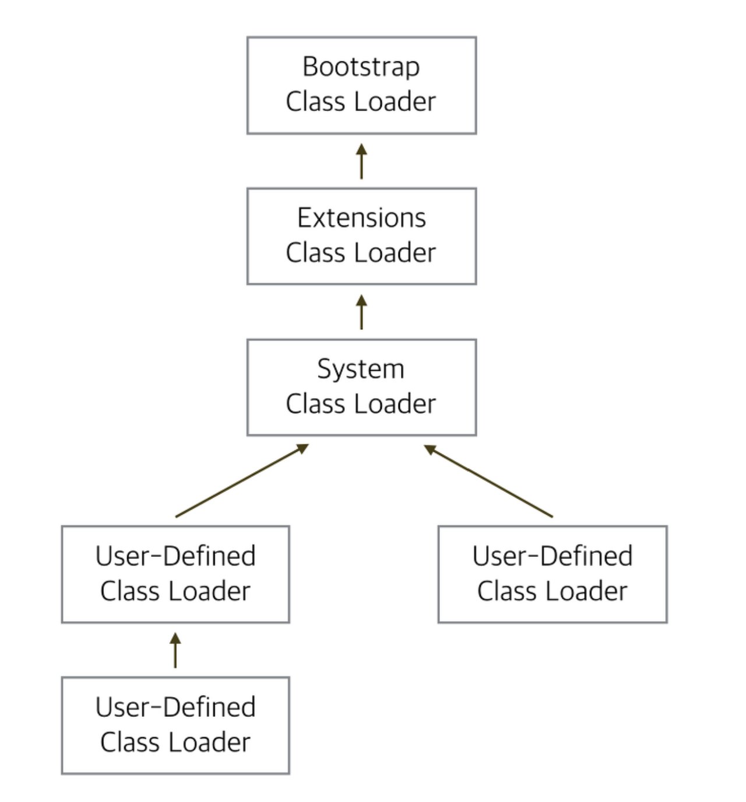

# ClassLoader

ClassLoader는 Runtime 중에 JVM 메서드 영역에 동적으로 Java 클래스를 로드하는 역할을 한다.

자바는 동적로딩을 하는데, 이 동적로딩을 담당하는 부분이 ClassLoader이다.

## 동작과정

ClassLoader가 클래스를 메모리에 적재하는 과정은 크게 `Loading` , `Linking`, `Initializing` 세가지 단계로 이루어진다.


### 로딩(Loading)

- . class 파일이 JVM 에 의해 메서드 영역에 다음 정보를 저장한다.
  - 로드된 클래스 정보와 이 클래스의 부모 클래스 정보
  - 클래스 파일과 Class, Interface, Enum 관련 여부
  - 변수나 메서드 등 정보
- 로딩이 완료되면 클래스 타입의 메타데이터 객체 `Class<?>`를 생성해서 Heap 영역에 저장한다.

### 링킹(Linking)

- 검증(Verifying) : 읽어 들인 클래스가 자바 언어 명세 및 JVM 명세에 잘 부합하는지 검사한다. 이 과정은 다소 오버헤드가 발생할수 있기때문에 클래스패스에 있는 클래스 파일이 믿을수 있다면 성능향상을 위해 생략할 수 있다. `Xverify:none`옵션을 통해 검증을 생략할수 있다.
- 준비(Preparing) : 클래스가 필요한 메모리를 할당하고, 클래스에서 정의된 필드.메서드, 인터페이스를 나타는 테이터 구조를 준비한다.
- 분석(Resolving) : 심볼릭 메모리 레퍼런스를 메서드 영역에 있는 실제 힙 메모리 영역에 있는 인스턴스에 대한 레퍼런스로 교체해준다. Constant Pool 의 심볼릭 레퍼런스를 실제 메모리 주소값으로 변경해주는 작업을 한다.

### 초기화(Initializing)

- 클래스 변수들을 적절한 값으로 초기화 한다. ex) static, super class, class


## 계층 구조

Java ClassLoader 계층구조는 Java8 버전과 Java9 버전과 다르다. ClassLoader 계층구조는 부모 자식 클래스로 구성되어있다. 



```java
public class ClassLoaders {

    private ClassLoaders() { }

    private static final JavaLangAccess JLA = SharedSecrets.getJavaLangAccess();

    // the built-in class loaders
    private static final BootClassLoader BOOT_LOADER;
    private static final PlatformClassLoader PLATFORM_LOADER;
    private static final AppClassLoader APP_LOADER;
    ....
}
```

- Bootstrap ClassLoader 
  - JVM이 실행될 때 맨 처음 실행되는 클래스 로더로 `$JAVA_HOME/jre/lib`에 있는 JVM 실행에 필요한 가장 기본적인 라이브러리(rt.jar 등)를 로딩한다.
  - 다른 클래스 로더와 달리 Native c 로 작성 되어 있다.
  - java9 이후 `/lib` 내에 모듈화 되어 포함되었다.

- Extensions ClassLoader
  - Bootsrap Loading 후 기본적으로 로딩되는 클래스로 `$JAVA_HOME/jre/lib/ext`에 있는 클래스들이 로딩된다. 이 클래들은 별도로 classpath에 잡혀 있지 않아도 로딩된다.
  - URL ClassLoader를 상속한다.
  - Java9 이후 `Platform ClassLoader` 로 변경되었고 BulltinClassLoader를 상속한다.
- System ClassLoader
  - `-classpath` 로 지정하거나 jar 파일 안에있는 mainfest 파일에서 Class-Path 속성에 지정된 클래스 파일들을 로드한다.
  - 개발자가 만든 클래스 파일을 로드한다. 

## ClassLoader 원칙

- 위임 원칙
- 가시범위 원칙
- 유일성의 원칙

## 동적 로딩

JVM 은 클래스에 대한 정보를 가지고 있지 않기 때문에, 런타임시 JVM이 ClassLoader를 통해서 클래스를 Load 하며 클래스에 대한 정보를 읽는다. 이를 동적 로딩이라고 한다.  이떄 ClassLoader 에서 Class를 Load 하는 시점에 따라 `Load-Time Dynamic Loading`과 `Run-Time Dynamic Loading`으로 구분된다.

`-verbose:class`옵션을 통해 로딩되는 클래스의 정보를 확인할 수 있다.

```java
[0.039s][info][class,load] opened: C:\Program Files\Eclipse Adoptium\jdk-11.0.17.8-hotspot\lib\modules
[0.054s][info][class,load] java.lang.Object source: jrt:/java.base
[0.054s][info][class,load] java.io.Serializable source: jrt:/java.base
[0.054s][info][class,load] java.lang.Comparable source: jrt:/java.base
[0.054s][info][class,load] java.lang.CharSequence source: jrt:/java.base
[0.054s][info][class,load] java.lang.String source: jrt:/java.base
[0.055s][info][class,load] java.lang.reflect.AnnotatedElement source: jrt:/java.base
[0.055s][info][class,load] java.lang.reflect.GenericDeclaration source: jrt:/java.base
[0.055s][info][class,load] java.lang.reflect.Type source: jrt:/java.base
 ...
```


### Load-Time Dynamic Loading

JVM이 시작되고 클래스 파일을 로드할때, 모든 클래스의 최상위 클래스인 Object 클래스와 기본 자바 API `java.util`, `java.lang` 등을 로드한다. 

### Run-Time Dynamic Loading

main 메서드가 실행되고 난후 호출되는 메서드를 통해 클래스가 로드된다. 이를 통해 다형성을 구현할 수 있다. 

