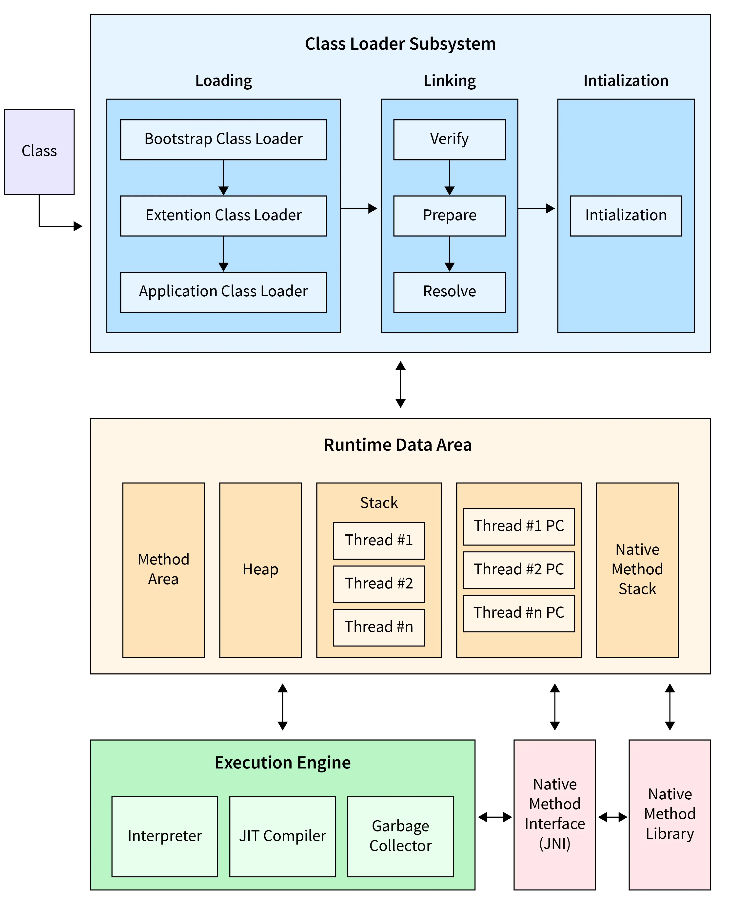
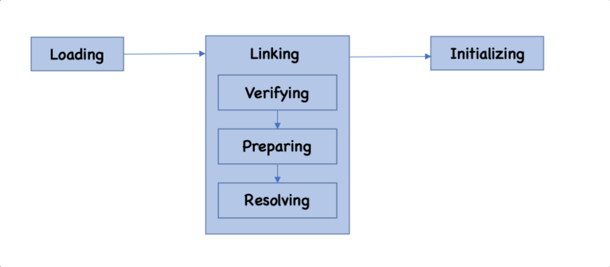

# JVM

JVM 은 Java Virtual Machine 의 줄임말로, 가상머신이라고 부른다. 초기 JVM 은 Java 플랫폼만 지원되도록 설계되었지만, 현재는 Kotlin, Groovy, Scala 등 다양한 언어를 지원하고 있다. 

JVM 은 java 소스파일이 컴파일된 바이트코드를 실행할수 있는 환경이다. 바이트코드는 JVM이 설치된 플랫폼이라면 어디서든지 실행될수 있다. 바이트 코드 관점에선 플랫폼 종속적이지 않지만, JVM은 플랫폼에 의존적이고 각 플랫폼에 맞는 JVM이 존재한다. 

JVM은 `JRE(Java Runtime Environment)`에 포함되어 있으며, Java 컴파일러가 프론트엔드를 담당한다면 JVM은 코드 최적화와 백엔드를 담당한다(웹이 아닌 컴파일러의 프론트엔드/백엔드를 말하는 것이다).

## java 코드 실행 과정

1) java 소스 파일을 java compiler(javac) 를 통해 java bytecode(class) 로 컴파일 한다.
2) bytecode(class) 를 JVM 의 ClassLoader 에게 전달한다.
3) ClassLoader 가 동적 로딩을 통해서 필요한 클래스를 로딩 및 링크하여 Runtime Data area, 즉 JVM의 메모리에 올린다.
4) ExecuteEngine은 JVM 메모리에 올라온 바이트코드들을 명령어 단위로 하나씩 가져와서 실행한다. 

## JVM 명세

[JVM 명세]([The Java® Virtual Machine Specification (oracle.com)](https://docs.oracle.com/javase/specs/jvms/se11/jvms11.pdf)) 를 따르기만 한다면 누구나 JVM 을 개발하여 제공할수 있다.  이러한 명세들을 지켜서 만들고 배포하는 곳을 vendor 라고 하며 요즘 유명한 vendor 는 Oracle 의 Hotspot, IBM 등이 있다. 

> To implement the Java Virtual Machine correctly, you need only be able to read the class file format and correctly perform the operations specified therein. Implementation details that are not part of the Java Virtual Machine's specification would unnecessarily constrain the creativity of implementors. For example, the memory layout of run-time data areas, the garbage-collection algorithm used, and any internal optimization of the Java Virtual Machine instructions (for example, translating them into machine code) are left to the discretion of the implementor.

JVM 명세를 보면 위와 같은 말을 찾아 볼수 있는데,  JVM을 올바르게 구현하려면 클래스 파일 형식만 읽고, 여기에 명시된 작업을 올바르게 수행하기만 하면 되고,  명령에 대한 구체적인 내용은 구현자의 창의력을 저해시킬수 있기때문에 JVM 명세에 명시하지 않는다고 한다.  예를 들어

- 런타임 영역에서 메모리 배치
- garbage collection 알고리즘
- JVM 명령의 내부적인 최적화

등은 구현자의 재량에 맞긴다고 한다. 

## JVM 구조

JVM 구조는 크게 `클래스 로더` , `실행 엔진`, `런타임 영역`, `네이티브 메서드 인터페이스` , `네이티브 메서드 라이브러리` 로 구성되어 있다. 

### ClassLoader

ClassLoader는 Runtime 중에 JVM 메서드 영역에 동적으로 Java 클래스를 로드하는 역할을 한다. 

자바는 동적로딩을 하는데, 이 동적로딩을 담당하는 부분이 ClassLoader이다.

- 동작과정

  - ClassLoader가 클래스를 메모리에 적재하는 과정은 크게 `Loading` , `Linking`, `Initializing` 세가지 단계로 이루어진다.

    

    - 로딩(Loading)

      - . class 파일이 JVM 에 의해 메서드 영역에 다음 정보를 저장한다.
        - 로드된 클래스 정보와 이 클래스의 부모 클래스 정보
        - 클래스 파일과 Class, Interface, Enum 관련 여부
        - 변수나 메서드 등 정보

    - 링킹(Linking)

      - 검증(Verifying) : 읽어 들인 클래스가 자바 언어 명세 및 JVM 명세에 잘 부합하는지 검사한다.  이 과정은 다소 오버헤드가 발생할수 있기때문에 클래스패스에 있는 클래스 파일이 믿을수 있다면 성능향상을 위해 생략할 수 있다.  `Xverify:none`옵션을 통해 검증을 생략할수 있다.

      - 준비(Preparing) : 클래스가 필요한 메모리를 할당하고, 클래스에서 정의된 필드.메서드, 인터페이스를 나타는 테이터 구조를 준비한다.
      - 분석(Resolving) : 심볼릭 메모리 레퍼런스를 메서드 영역에 있는 실제 힙 메모리 영역에 있는 인스턴스에 대한 레퍼런스로 교체해준다. Constant Pool 의 심볼릭 레퍼런스를 실제 메모리 주소값으로 변경해주는 작업을 한다.  

    - 초기화(Initializing)

      - 클래스 변수들을 적절한 값으로 초기화 한다. ex) static, super class, class
