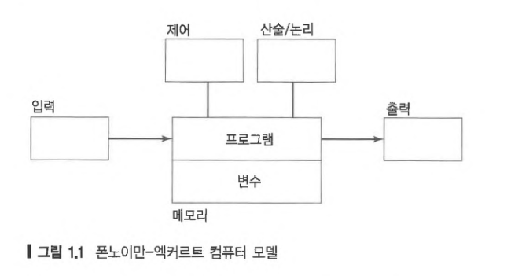
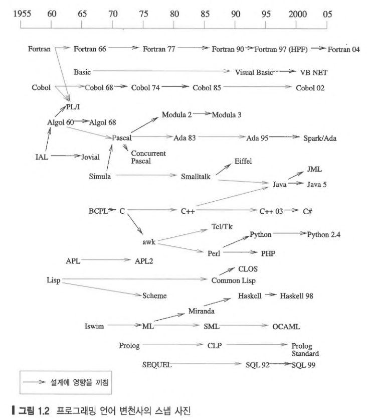
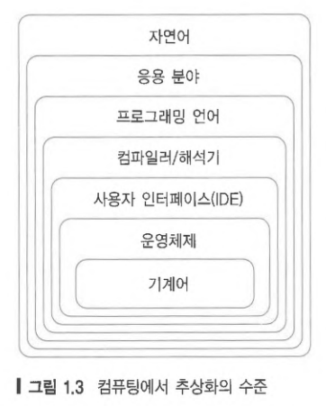
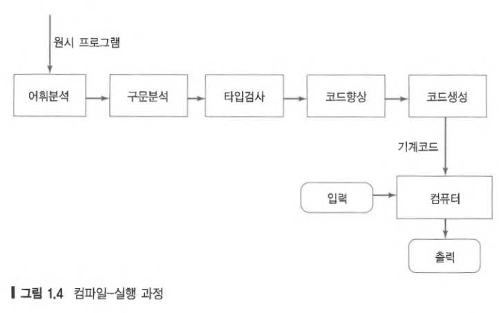
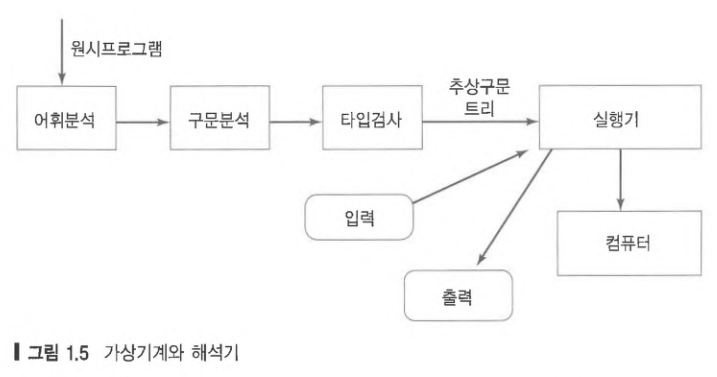

# 1. Overview
우리가 일상생활에서 사용하는 자연어와 마찬가지로 프로그래밍 언어는 사람들 사이에 아이디어를 용이하게 표현하고 교환할 수 있게 해준다. 그러나 프로그래밍 언어는 두가지 점에서 자연어와 다르다

- 사람과 계산기 사이에 아이디어를 교환
- 자연어보다 표현하는 영역이 더 좁음

따라서 프로그래밍 언어는 자연어와는 다른 요구사항을 만족해야 한다.

## 1.1 Principles

언어 설계자는 그 언어가 어떻게 작동하는지 이해시켜주는 언어의 구조, 의미, 사용성에 대하여 기본 어휘력을 갖추고 있어야 한다. 이 기본 어휘는 언어 설계의 **원리(principles)** 라고 하는 4가지 주요 카테고리로 구분한다.

- Syntax (구문구조)
- Names (이름)
- Types (타입)
- Semantics (의미)

어느 언어에서나 언어 설계자들은 이 4가지 카테고리에 대해서 정의해야 하고 이 언어를 사용하는 프로그래머들은 이 카테고리에 대해 능숙해져야 한다.

### Syntax

프로그래밍 언어에서 `syntax` 는 구조적으로 맞는 프로그램이 어떻게 생겼는지를 서술한다.`Syntax`를 통해서 프로그램을 작성하기 위한 문법이나 구조적으로 맞는 프로그램을 작성하기 위한 단어나 심벌이 무엇인지를 알 수 있다.

현대 프로그래밍 언어의 `syntax`의 대부분은 **context-free grammer** 라고 하는 언어학의 형식화 기법으로 정의된다. `syntax` 외의 다른 요소는 **context-free grammer** 의 범위를 벗어나므로 다른 방법으로 정의한다.

`syntax` 를 공부하다보면 다음같은 궁금증을 가질 수 있다.

- 언어를 작성하기 위한 문법은 무엇인가?
- 기본 어휘는 무엇인가?
- 구문 오류는 어떻게 탐지할까?

### Names

프로그램에서 다양한 종류의 entity 들은 name 을 가지고 있다. 엔티티는 variables, types, functions, parameters, classes, objects, .. 등을 의미한다. 

이러한 엔티티의 이름에는 다음과 같이 프로그램이 실행되는 동안 가지는 다른 성질도 포함되어 있다.

- Scope (영역)
- Visibility (가시성)
- Type (타입)
- Lifetime (생존기간)

### Types

언어의 `type`은 값들의 집합과 그 값들에 대한 연산의 집합이다. 다른 말로 말하면 프로그램이 조작할 수 있는 값의 종류를 나타낸다. `type` 의 종류는 다음과 같다.

- Simple Types(단순 타입)
  - numbers, characters, booleans, ....
- Structured Types(구조 타입)
  - strings, lists, trees, hash tables, ....
- Complex Types(복잡한 타입)
  - functions, classes, ...

언어의 **type system** 은 프로그래머들로 하여금 `type` 의 값의 연산을 이해하고 적절히 구현할 수 있게끔 해준다. **type system**  을 잘 만들어 놓으면 `type` 에러를 발견하는 것과 `type`에 대한 합당한 연산을 결정하는데 도움이 된다. 

### Semantics

프로그램의 의미는 `semantics`  로 정의한다. 즉, 프로그램이 실행될 때 프로그램에서 변수의 값에 따른 각 문장의 실행결과는 언어의 `semantics` 가 지정한다. 특정 플랫폼에 독립적인 `semantics` 모델이 있다면, 그 모델을 그 언어가 구현되는 다양한 컴퓨터에 적용할 수 있을 것이다.

`semantics`를 공부하다보면 다음과 같은 궁금증을 가질 수 있다.

- 프로그램이 실행되고 있을때, 변수의 값들에 무슨 일이 일어나는가?
- 각각의 문장이 의미하는 바가 무엇인가? 
- 함수 호출과 같은 런타임 동작을 통제하는 기본 모델은 무엇인가?
- 런타임시, 객체들이 메모리에 어떻게 할당되는가?

함수는 어느 언어에서나 프로시저 추상화의 핵심요소이다. 함수 정의와 호출의 `semantics` 를 이해하는 것은 프로그래밍 언어 공부의 핵심이다. 함수를 구현하려면 **run-time stack** 을 포함하여 메모리의 정적 및 동적 요소를 이해햐아 한다.  stack을 이해하면 name 의 scope와 object 의 lifetime 과 같은 다른 개념도 이해할 수 있다.

함수 호출과 리턴을 stack 으로 구현하는 방법은 더 깊이 공부할 가치가 있는 중요한 주제이다. 더구나, heap 이라고 하는 메모리 구역을 관리하는 전략은 **배열과 같은 동적 객체** 를 이해하는데 중요하다. garbage collection 와 같은 heap 관리 기술은 이와 같은 **동적 객의 구현 **과 깊이 관련이 있다.

## 1.2 Paradigms

programming `paradigm` 은 특정 장르의 프로그램과 언어에 깔려있는 문제 해결 사고의 패턴이다. 뚜렷하고 기본적인 프로그래밍 패러다임 4가지가 진화해왔다.

- Imperative
- Object-Oriented
- Functional
- Logic(declartive)

어떤 프로그래밍 언어는 하나 이상의 `paradigm` 을 지원하도록 고의적으로 설계하기도 한다. 예를 들어, C++은 Imperative 와 Object-Oriented 의 혼합형이고, Leda 는 위 4가지 programming `paradigm` 을 모두 지원하도록 설계하였다. 

### Imperative

`Imperative` 프로그래밍은 고전적인 **폰노이만-엑커르트(von Neumann-Eckert)** 의 계산 모델에 기초한 가장 오래된 `paradigm` 이다. 폰노이만-엑커르트 모델은 다음과 같은 특징을 지닌다.

- program 과 data는 메모리에서 구별할 수 없다.
- program  = a sequence of commands
- state = values of all variables when program runs
- large program 들은 procedural abstraction(절차적 추상화) 를 사용한다.

이 모델에서 프로그램과 변수는 같이 메모리에 저장되고, 프로그램은 계산하거나, 변수에 값을 저장하거나, 입력을 받거나, 출력을 내주거나, 다른 곳으로 제어방향을 전환하는 명령문의 나열이다.



프로시저 추상화는 `Imperative` 프로그래밍에서 필수적인 구축 블록이다. 저장문, 루프, 문장나열, 조건 문장, 예외처리도 마찬가지다. 대표적인 `Imperative` 언어로는 Cobol, Fortran, C, Ada, Perl 이 있다.

### Object-Oriented

`Object-Oriented` 프로그램은 상태를 변환시키는 메시지들 주고 받으며 상호 교류하는 객체들의 집합체이다. 데이터 객체는 메시지를 전달하므로 수동적이라기보다 능동적이라고 할 수 있다. 이러한 특성은 `Imperative` 프로그래밍과 구별되는 점이다. 객체 분류, 상속, 메시지 전달은 `Object-Oriented` 프로그래밍의 기본적인 구축 블록이다. `Object-Oriented`를 공부하면서 다음과 같은 것을 배우게 된다.

- Sending Messages
- Inheritance
- Polymorphism

대표적인 `Object-Oriented` 언어로는 Smalltalk, C++, Java, C# 등이 있다.

### Functional

`Functional` 프로그래밍은 연산을 수학적인 함수의 집합으로 모델링한다. 

- input = domain
- output = range

각 함수는 입력 도메인과 출력 도메인이 있으며, 이 점이 저장문을 기본으로 하는 언어들과 다른 점이다. 예를 들어 다음 저장문은 `Functional` 프로그래밍이므로 수학적으로 말이 되지 않는다.

```text
x = x + 1
```

`Functional` 언어들은 다음과 같은 것으로 특징지어진다

- Functional composition
- Recursion

대표적인 `Functional` 프로그래밍 언어로는 Lisp, Scheme, Haskell, ML 등이 있다.

### Logic

`Logic` 프로그래밍 또는 `declarative`  프로그래밍은 어떻게 문제를 풀 것인지를 고민하는 대신, 프로그램이 얻어야할 결과가 무엇인지를 **선언** 하도록 문제를 모델링하여 프로그램을 작성한다. 이러한 유형의 언어를 **rule-based languages** 라고 하는데, 프로그래밍의 선언부가 수행할 명령의 나열이 아닌, 문제에 대한 규칙이나 제한식 같아 보이기 때문이다.

`Logic` 프로그래밍을 공부할때 다음과 같이 인지한다

- Programs as sets of constraints on a problem
- Programs that achieve all possible problems
- Programs that are nondeterministic

## 1.3 Special Topics

4가지 `paradigm` 이외에도 다룰 만한 주요 개념 몇 가지 있다. 이 개념들은 **두 개 이상의 패러다임이 동시에 나타난다** 는점에서 꽤 영향력 있는 편이다. 

- Event Handling
- Concurrency
- Correctness

### Event Handling

`Event Handling`은 **예측 불가능한 순서로 생성되는 이벤트에 반응** 하는 프로그램에서 일어난다. `Event Handling`은 `imperative paradigm` (ex Tcl/Tk) 에서 일어나기도 하지만, `object-oriented paradigm`  과 맞물려 흔히 사용된다(ex : Java Applet). 이벤트는 스크린에서 사용자에 의해 시작되거나(ex : 마우스 클릭, 키보드 입력), 다른 소스에서 시작된다. 이벤트 처리를 지원하는 대표 언어는 Visual Basic, Java, Tcl/Tk 등이 있다.

### Concurrency

`Concurrent Programming` 은 **대표적인 4가지 패러다임 어디에서든 일어날 수 있다.**  정보를 공유하거나 필요시 서로 동기화하는 비동기 적인 요소들이 프로그램에 포함되어 있을 때  `Concurrency` 가 발생한다. `Concurrency`는 루프를 동시에 돌리는 것과 같이 개별 프로세스 안에서도 일어날 수 있다. `Concurrency` 프로그래밍 언어는 SR, Linda, Performance Fortran 등이 있다.

### Correctness

`Correctness` 는 가능한 모든 입력에 대해서 프로그램이 정형명세를 만족하면, 그 프로그램은 `Correctness` 이 있다. 다양한 응용 분야에서 증명가능한 `Correctness` 있는 프로그램을 설계하기 위해 새로운 언어와 언어 기능들이 진화하고 있다.  `Correctness` 에 대한 증명은 복잡한 주제이지만, 프로그래머가 `correctness` 을 정형적으로 증명할 수 있는 언어 도구가 이제는 가용하게 되었다. 예를 들어, Spark/Ada 시스템과 Java Modeling Language 가 좋은 사례이다.

## 1.4 A Brief History

최초 프로그래밍 언어는 1940년에 시작된 컴퓨터의 기계어와 어셈블리어 였다. 그 이후 수백 종의 프로그래밍 언어와 사투리가 개발되어 왔다. 대부분 수명이 짧았던 반면, 몇몇은 하나 이상의 응용 분야에서 널리 보급되어 쓰였다. **이전 언어들이 추후 새로운 언어를 만드는데 중요한 역할**을 하게 되었는데, 그림에서 화살표는 이전 언어가 새로운 언어를 만드는데 중요한 설계 영향이 있었음을 표시하고 있다.



1950년대에는 **고수준 언어(higher-level language)** 의 시대가 시작되었다. `고수준언어` 는 기계어와 어셈블리어와 다르게 프로그래밍 스타일이 **컴퓨터 구조와 독립적**이다. 최초 고수준 언어는 Fortran, Cobol, Algol, Lisp 이다. 이중 Fortran 과 Cobol 은 살아남아서 탄생이래 많이 진화하였다. 

지난 몇 십 년간 프로그래밍 언어 발전에 주요한 역할을 했다고 하는 사용자 커뮤니티는 다음과 같다.

- Artificial Intelligence
- Computer Science Education
- Science and Engineering
- Information Systems
- Systems and Networks
- World Wide Web

## 1.5 On Language Design

프로그래밍 언어의 설계는 매우 힘든 도전이다. 언어 설계자는 언어 설계를 위해 `Design Constraint` 테두리 안에서 작업해야 하고, 구체적인 목표들을 세우고 이를 통합하여 목표에 초점을 맞추어야 한다. 

### 1.5.1 Design Constraint

언어 설계자의 `Design Constraint` 는 다음과 같다.

- Computer architecture
- Technical Setting
- Standards
- Legacy Systems

#### Computer architecture

프로그래밍 언어는 컴퓨터에 쓰려고 설계된다. 컴퓨터 설계는 대부분 앞서 전통적인 폰노이만-액커드 모델의 구조개념을 벗어나지 않았기 때문에 이러한 사실이 언어 설계자에게는 축복이되기도 하고 저주가 되기도 한다.

언어 설계에서 당면한 다양한 선택을 앞두고 가치를 판단하면서, 언어를 효율적으로 구현해야 한다는 부담을 가지면서 전통적인 폰노이만 모델로 인해서 부가된 제약 안에서 항상 효과적이어야 한다.

#### Technical Setting

언어 설계는 `Technical Setting` 인 응용분야, 운영 체제 , IDE, 네트워크, 특정 프로그래밍 커뮤니티의 선호에 의해서 부가되는 다른 제약사항도 만족해야 한다. 언어 설계에 필요한 복잡한 환경을 크게 표현한 그림이 다음과 같다.



일부 언어는 설계 당시에 다방면의 응용에 관심을 두고 고의적으로 다목적 혹은 특수목적으로 설계하기도 한다. 

- general-purpose(다목적) : Cobol, Ada
- special-purpose(특수목적)
  - prolog : 자연어 처리, 정리 증명, 전문가 시스템
  - c : 원래 다양한 응용분야에 적용되어 사용되어 왔지만, 원래는 시스템 프로그래밍에 맞게 설계
  - spark/ada : Ada 와 Java 프로그래밍의 정확성에 대한 정형 증명을 지원하기 위해 설계

#### Standards

프로그래밍 언어가 널리 사용되기 시작하면, 표준화 과정이 시작된다. 즉, 언어를 구현하려면 반드시 따라야 하는 기계 독립적인 언어의 정의 표준을 정의한다. 언어의 표준화는 상이한 플랫폼과 프로그래밍 그룹을 통해서 일반적으로 안정을 시켜 **프로그램의 이식성을 가능하게 한다.**

프로그래밍 언어의 표준을 감독하고 유지하는 대표적인 기관은 ANSI, ISO 이다. 

프로그래밍 언어의 표준화는 문자집합(ASCII, UNICODE) 과 프로그래밍 활동을 직접 지원하는 라이브러리(C++ 펴준 템플릿 라이브러리) 의 표준화가 동반되어야 한다.

일부에서는 언어 설계에서 기술 혁신을 억제한다는 이유로 표준화에 대해서 부정적인 견해를 보이는 사람들도 있지만 한번 언어의 표준을 만들어 놓으면, **오랫동안 표준이 지속되는 경향이 있고, 따라서 가장 가치 있는 기능과 부실한 기능이 함께 영속할 수 있다.**

#### Legacy System

프로그래머가 소비하는 시간의 대부분은 `Legacy System`을 유지하는데 소비한다는 사실은 잘 알려져 있다. `Legacy System` 이란 이전 프로그래머가 설계하고 구현하였고 현재 다른 프로그래머가 유지 관리하는 소프트웨어 레거시를 의미한다.

`Legacy System` 을 유지 지원하기 위해서 `backword compability`를 만족해야 한다. 즉, 오래된 프로그램은 개량된 언어의 새로운 컴파일러로도 계속 컴파일 및 실행되어야 한다.

오래된 프로그래밍 언어는 새로운 버전이 나오면 기능이 더 많아지므로, 언어는 진화하면서 더 간결해지는 일은 거의없다. 

### 1.5.2 Design Outcomes and Goals

위와 같은 요구사항을 잘 분석해보면 다음 두 가지 중요 질문이 나온다.

- 프로그래밍 언어는 어떻게 생겨나고 어떻게 하면 성공하는가?
- 이상적인 프로그래밍 언어가 되려면 어떤 주요 특징이 필요한가?

과거 성공한 프로그래밍 언어들에 대한 설계자는 개인 이나 산업체 또 후원사의 강력한 요구의 산물이 되기도 했다. 이에 따라서 설계 과정이 언어 설계 성공에 얼마나 중요한 영향을 끼쳤는지 명확하지 않다.

프로그래밍 언어를 평가하고 비교하는 주요 기준이 있고 이를 수행할 수 것을 이를 설계 목표라고 한다. 다음과 같은 설계목표는 오랜기간동안 **성공적인 언어 설계를 효과적으로 측정하는 기준**으로 사용되어 왔다. 

- Simplicity and readability
- Clarity about binding
- Reliability
- Support
- Abstraction
- Orthogonality
- Efficient implementation

#### Simplicity and readability

프로그램은 작성하고 쉽고 보통 수준의 프로그래머가 이해하기 쉬워야 한다. 게다가 배우고 가르치기도 쉬워야 한다.

- Small instruction set
  - Java vs Scheme
- Simple Syntax
  - C/C++/Java vs Python

#### Clarity about Binding

언어에서 필요한 요소들은 그 특성이 정의될 때 Binding이 된다. 그러므로 Binding 은 객체와 그 객체의 특성사이의 연결이라고 할 수 있다.

- a variable and its type
- a variable and its value

 잘 설계된 언어는 각 요소에 대해서 그 특성이 언제 Binding 되는지 명확해야 한다. 다음은 주요 요소들이 Binding 되는 시점이다.

- 언어 정의 시점 : 언어가 정의될 때, 데이터 타입은 그를 나타내주는 **reversed word** 라고 하는 특별히 정해진 이름으로 Binding 된다. ex) in C, int -> 정수, float -> 실
- 언어 구현 시점 : 언어의 컴파일러 또는 인터프리터를 만들때, 컴퓨터로 표현할 값들의 범위가 Binding 된다.

- 프로그램 작성 시점 : 프로그램을 작성할 때 변수 이름에 타입이 Binding 되고, 이 것이 프로그램 실행 전반에 걸쳐시 그 타입이 유지된다.

```text
int x;
```

- 컴파일 시점 : 프로그램이 컴파일 될때,  프로그램 문장과 계산식은 동등한 의미를 가진 기계어의 명령어들로 Binding 된다.
- 프로그래밍 로딩 시점 : 기계어가 로딩 될때, 정적변수들은 고정된 메모리 주소에 배정되고, Runtime stack 은 메모리 블록이 할당되고, 기계어 자체도 메모리 블록에 할당된다.

- 프로그래밍 런타임 시점 : 프로그램이 실행될 때, 변수에 값이 Binding 된다. 예를 들어 x = 3 이 실행되면, 변수 x 에 3이 Binding 된다.

위의 Binding 과정에서 한 요소가 한 특성에 여러번 Binding 될 수 있다. Binding 시점에 따라 early binding 과 late binding으로 나뉜다.

`early binding` : 가능한 빨리 Binding 되도록 하는 것 (compile-time), 오류 탐지에 유리하고 비용이 적게 든다

`late binding` : 가능한 늦게 Binding 되도록 하는 것 (run-time), 프로그램 작성에 유연성 제공한다.

#### Reliability

다음 조건을 만족하면 프로그래밍은 Reliability 가 있다고 한다

- Program behavior is the same on different platforms?
  - early versions of Fortran
- Type errors are detected
  - C vs Haskell
- Semantic errors are properly trapped
  - C vs C++
- Memory leaks are prevented
  - C vs Java

#### Language Support

좋은 프로그래밍 언어는 배우고자 하는 사람에게 있어 쉽게 접근할 수 있게 해야한다. 이상적으로 컴파일러는 공개 소프트웨어이어야 한다. 언어는 여러플랫폼에서 실행할 수 있어야 한다. 물론 레퍼런스나 언어에 능숙한 사람이 많아야 언어의 생명력이 보존되고 연장 될 수 있다. 또한 사용할 수 있는 IDE 가 존재해야 한다.

#### Abstraction

추상화는 프로그래밍 언어의 설계 과정에서 필수적인 부분이다. 프로그래머는 **코드의 재사용과 수정 가능성을 줄이기 위해 데이터 추상화 및 프로시저 추상에 많은 시간을 소비한다.** 

- Data
  - Programmer-defined types/classes
  - Class libraries
- Procedural
  - Programmer-defined functions
  - Standard function libraries

예를 들어 Java 의 클래스 라이브러리에는 기본 데이터 구조 (ex: Vector, Stack) 의 구현이 포함되어 있는데, 초기 언어에서는 프로그래머가 스스로 작성해야 했던 것들이었다.

#### Orthogonality

소규모이고 상호 독립된 기본 연산만으로 구축할 수 있는 언어를 `Orthogonal`  이라고 한다. 언어가 더 직교적일수록, 정확한 프로그램을 작성하는 데 필요한 예외 규칙이 더 적어진다. 따라서 `Orthogonal` 언어로 작성된 프로그램은 **직교적이지 못한 언어로 작성된 프로그램에 비해서 더 간단하고 명확한 경향**이 있다. 

함수 호출에서 인수 전달을 예로 들면, 직교성이 있는 언어라면 함수 정의를 포함해서 어떤 타입의 객체도 인수로 전달할 수 있다. 

직교성이 좋은 경우 프로그래머가 예외 규칙을 많이 외워둘 필요가 없으므로, 직교성은 **개념적으로 단순한 것과 관련이 있는 경향** 이 크다. 앨런 펄리스는 이렇게 표현하였다.

>  10개의 데이터 구조에 10개의 함수가 있는 것보다, 1개의 데이터 구조에 100개의 함수가 있는 것이 더 좋다.

반면 직교성이 나쁜 경우 예외 규칙이 미리 지정되어 있어 시간과 공간이 소비되는 추가 프로그래밍이 필요 없어므로, 반직교성은 효율성과 주로 관련이 있다.

#### Efficient implementation

언어의 기능과 구조는 그 시대에 가용한 플랫폼에서 실용적이고 효율적으로 구현될 수 있어야 한다. 

- Embedded systems
  - Real-time responsiveness
  - Failures of early Ada implementations
- Web applications
  - Responsiveness to users
- Corporate database applications
  - Efficient search and updating
- AI applications
  - Modeling human behaviors

## 1.6 Compilers and Virtual Machines

프로그래밍 언어의 구현은 그 언어로 작성된 프로그램을 분석하고 다음의 둘 중의 하나를 할 수 있는 형태로 번역된다.

- Compiler - produces machine code
- Interpreter - executes instructions on a virtual machine

Example compiled Languages

- Fortran, Cobol, C, C++

Example interpreted Languages

- Scheme, Haskell, Python

Hybrid compilation/interpretation

- The Java Virtual Machine(JVM)

### Compiler

컴파일은 원시 프로그램을 컴퓨터 언어로 번역하는 과정이다. 그 결과물인 기계 코드는 그 컴퓨터에서 실행될 수 있다.

컴파일의 다섯 단계 과정은 다음과 같이 5가지로 구분된다.

- 어휘 분석
- 구문 분석
- 타입 검사
- 코드 향상(최적화)
- 코드 생성

앞부분 세 단계는 오류를 찾아서 프로그래머에게 보고하는 것과, 마지막 두 단계는 대상 컴퓨터에서 실행되는 효율적인 기계 코드를 생성하는것과 관련있다.



### Virtual Machine and Interpreter



위 그림과 같이 일부 언어들은 바로 실행되도록 구현된다. 여기서 원시 프로그램은 중간 단계인 추상적인 형태로 번역된 후 바로 실행된다.

그림에서 볼 수 있듯이, 컴파일러 앞부분 세단계는 interpreter 에도 포함된다. 그러나 이 세단계의 결과인 추상구문트리가 interpreter의 실행되는 대상이 된다. 보통 interpreter 는 실행되상이 되는 언어와 다른 언어로 작성된다.

때때로 언어는 추상적인 Virtual Machine 대상 코드로 번역하는 Compiler 를 한번 작성하고, 다양한 실제 컴퓨터마다 각각 Virtual Machine은 interpreter로 구현되게 설계하기도한다. JVM 이라고 하는 추상컴퓨터를 이용하는 Java의 경우가 바로 그렇다. Java 언어 설계자는 효율성을 약간 포기하고 유연성과 이동성을 위해 이런 선택을 했다. 즉, Java 언어 명세가 수정이 되면 여러 컴파일러를 기계별로 다 수정할 필요 없이 하나만 수정하여 구현하면 된다.

바로 실행하는 것에 비해 컴파일이 프로그램의 실행시간 수행 성능이 더 효율적이다. 반면 프로그래머가 시스템과의 상호작용의 질은 Interpreter 가 Compiler 보다 훨씬 좋다. 

Java 의 나중 버전에는 JVM 에 JIT Compiler를 장착하여 효율성을 어느정도 증가시켰다. 이 기능으로 JVM 바이트코드를 실행전에 필요하면 호스트 컴퓨터의 기계코드로 번역할 수 있다.

