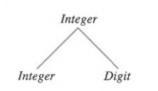
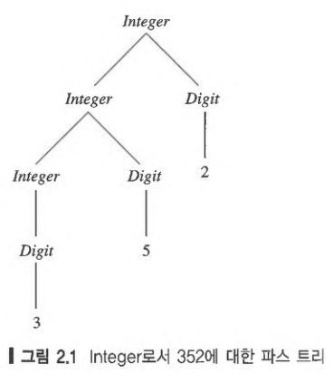
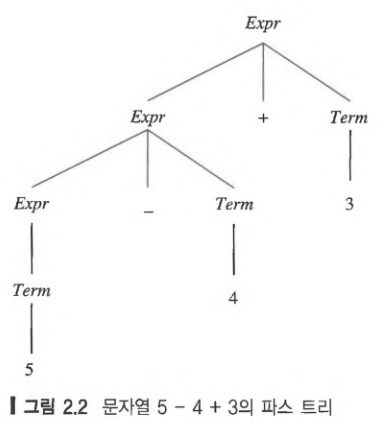
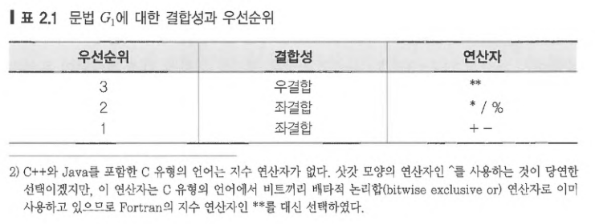
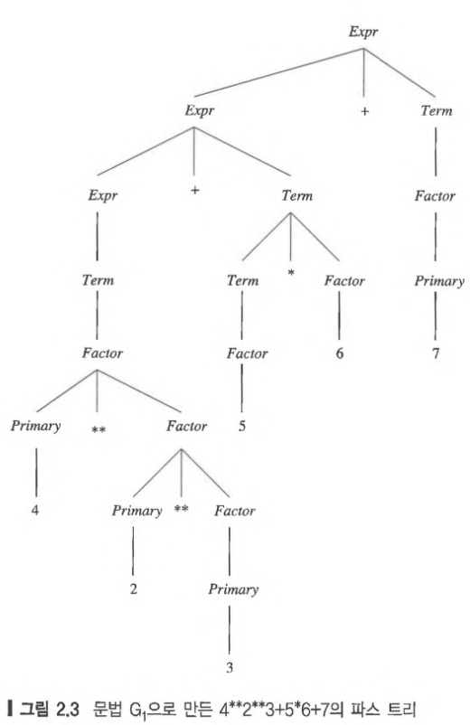
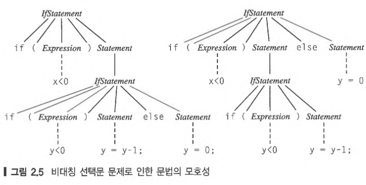

# 2.Syntax

프로그램은 (**how to write?**) 생김새와 (**what kind of results if run?**) 뜻으로 나눈다. 일반적으로, 프로그램의 생김새는 **syntax** 라고 하고, 프로그램의 뜻은 **semantics** 라고 한다.  컴파일러는 프로그램에서 syntax error 와 type 및 선언 오류를 찾아내는 반면, 컴파일러가 찾아내지 못하는 0으로 나누기 같은 runtime error는 본질적으로 semantic error 다.

> 프로그래밍 언어의 **syntax** 는 문법적으로 맞는 모든 프로그램을 정확하게 기술한 것이다.

`syntax` 는 자연어의 경우와 마찬가지로 문법규칙의 집합으로 기술할 수 있다. 프로그램에서 syntax specification 이 없으면 컴파일러 작성자와 프로그래머들이 작업을 재대로 하기 힘들어진다.

`syntax`를 정의하는 정형적인 방법은 60년대 초 ALgol 에서 사용되면서 등장한 이래, 대부분 언의의 `syntax` 를 정의하는데 사용되고 있다. 

프로그래밍 언어의 `syntax` 는 어휘(lexical), 구체(concrete), 추상(abstract)  단계로 나누어 정의하는 정형적 방법 및 비정형 방법이 있다.

> **lexical syntax** : 식별자, 리터럴, 연산자, 구두점에 대한 규칙을 정의한다.
>
> **concrete syntax** : 어휘 기호를 알파벳으로 사용하여 프로그램을 실제로 표현할 수 있는 규칙을 정의한다.
>
> **abstract syntax** : 구두점이나 괄호와 같은 구문 인식 전용 구문을 제외한 핵심적인 프로그램 구문 정보만 가지고 있다.
>
> - C : if (expr) ... discard()
> - Ada : if (expr) then discard then

## 2.1 Grammar

언어의 `syntax` 는 `grammar` 라고 하는 형식으로 대부분 명세할 수 있다. 문법은 `meta language` 로 작성되며, 구문적으로 유효한 프로그램을 작성할 수 있는 합당한 string 을 정의하는 것이다.

> A *grammar* is a metalanguage used to define the syntax of lanugage

`grammar` 는 Noam chomsky(노암 촘스키) 가 4계층으로 분류하여 개발한 형식 이론을 기반으로 한 `meta language` 다.

- regular
- context-free
- context-sensitive
- unrestricted

> **context-free grammar** 은 생성 규칙 : $P$ , 단말자 기호 집합 : $T$, $w$  , 비단말자 기호 집합 : $N$, 시작 기호: $S,S\in N$ 로 구성된다.
>
> **production** 은 $A \to w$  의 형태이다.   $A \in N$, $w \in (N \cup T)^\ast$  

BNF 는 **context-free grammer** 를 표현하고, 이는 프로그래밍 언어의 `syntax`를 정의하는데 널리 사용되어 왔다.

### 2.1.1 BNF Grammar

1960년 존 백케스와 피터 나우어가 촘스키 이론을 기초로 BNF를 만들어내었다. 대부분 문헌에서 그렇듯이 **BNF Grammar** 이라는 용어를 **context-free grammar** 의 동의어로 차별없이 사용한다.

$P$ 는  **문장형식(sentinel-form)** 이라고 하는 기호 스트링을 적용할 수 있는 재작성 규칙이다. 비단말자 $A$ 는 문장형식이 있는 $w$ 와 대체될 수 있다.  기호 $A$를 $P$ 의 **좌변 (left-hand side)** 이라고 하고, 스트링 $w$ 를 **우변(right-hand side)** 이라고 한다. BNF 문법에서 단말자와 비단말의 집합은 공통되는 부분이 없다.

BNF 문법을 프로그래밍 언어의 `syntax` 를 정의하는데 쓰는 경우 $N$ 은 Identifier, Integer, Expression, Statement, Program 과 같은 언어의 문법 카테고리를 나타낸다.  $S$ 는 (여기서는 Program) 문법으로 정의된 으뜸 문법 카테고리를 가리키고, 보통 첫 $P$ 로 정의된다. $T$는 프로그램을 구성하는 기본 알파벳으로 이루어진다.

```
binarydigit -> 0
binarydigit -> 1
```

위 $P$ 쌍은 *binarydigit* 가 0 아니면 1이고, 다른건 아니라고 정의한다. $N$ 은 최소한 하나의 $P$ 좌변에 나타나는 기호이다. 위 문법에서 *binarydigit* 은 유일한 $N$ 이다. $w$ 는 $P$ 에서 나오는 그 이외의 모든 기호이다. 위 문법에서는 0 과 1 이 $w$ 이다.

$P$ 에서 좌변이 모든 같은 $N$ 일 경우, 하나의 $P$ 로 합할 수 있다. 예를 들어 위 두 $P$ 는 다음과 같이 줄일 수 있다.

```text
binarydigit -> 0 | 1
```

이 경우 or 나 양자택일을 의미하는 수직선(|) 로 분리한다. 위 예에서 `->` 나 `|` 는 정의하는 언어에 속해있는 기호가 아니므로 **meta symbol** 이라고 한다.

BNF 의 $P$ 의 우변은 $N$ 과 $w$ 를 나열할 수 있어서 관심있는 다양한 구조를 간결하게 정의할 수 있다. 문법 카테고리 *Integer* 를 십진수 *Digits* 의 나열로 정의하는 다음 BNF 문법 $G_{integer}$ 는 다음과 같다.
$$Integer \to Digit \ | \ Integer \ Digit$$
$$Digit \to 0 \ | \ 1 \ | \ 2 \ | \ 3 \ | \ 4 \ | \ 5 \ | \ 6 \ | \ 7 \ | \ 8 \ | \ 9 $$

위 에서 두번째 $P$ 에서 일반적인 십진 숫자를 정의한다. 첫번째 $P$ 에 따르면, *Integer* 는 *Digit* 만 나오거나,  *Integer* 가 나오고 그 뒤에 *Digit* 가  나온다.  이 $P$ 의 두번째 선택($Integer \: Digit$) 은 **재귀적으로 정의되었으므로 임의로 긴 기호의 나열을 정의 할 수 있다.** 결론적으로 이 $P$ 는 *Integer* 를 하나 이상의 숫자의 나열로 정의한다.

> BNF 는 Algol60 의 **syntax** 를 정의하는데 전용으로 사용되는 **meta language** 로 시작했다. $N$ 는 각진 괄호를 이름에 둘러싸아 표시했는데, 최소한 하나의 $P$ 의 좌변에 나타났다. **meta language** 인 `:` 와 `|` 를 제외한 다른 기호는 모두 $w$ 취급 되었다.
>
> 따라서 Integer에 대한 문법은 BNF로 다음과 같이 표현하였다.
>
> ```text
> <integer> ::= <digit> | <integer>  <digit>
> <digit> ::= 0 | 1 | 2 | 3 | 4 | 5 | 6 | 7 | 8 | 9
> ```
>
> 오리지날 BNF 표기법은 그 당시의 제한된 입력 문자 집합에 맞추도록 설계되었지만, 컴퓨터 기술이 발전하면서 더 표현력이 좋은 표기를 만들어 낼 수 있는 표준 입력 장치를 사용하게 되자, 표기를 더이상 제한할 필요가 없어졌다. 

### 2.1.2 Derivations

특정기호 스트링이 어떤 문법적 카테고리에 속하는지 알아보려면, 그 카테고리의 $P$ 를 사용하여 그 스트링을 유도해보면 된다. 예를 들어 $352$ 가 $Integer$ 카테고리에 속하는지 알아보고 싶다면, 그 문법의 $P$ 를 사용하여 다음과 같이 이 스트링을 유도할 수 있다.

1. 먼저, 시작 기호인 $Integer$ 를 적는다.  

$$Integer$$

2. 첫 번째 $P$ 의 우변 두 번째 선택 규칙을 적용하여 $Integer$ 를 $Integer \ Digit$ 로 바꾼다.

$$Integer \Rightarrow Integer \ Digit$$

3. 같은 규칙을 다시 한번 적용하여 이 스트링의 $Integer$ 를 $Integer \ Digit$ 으로 바꾸면, $Integer \ Digit \ Digit$ 이된다.

$$Integer \ Digit \Rightarrow \ Integer \ Digit \ Digit$$ 

4. 이번에는 첫번째 $P$ 의 우변 첫 번째 선택 규칙을 적용하여 이 스트링의 $Integer$ 를 $Digit$ 으로 바꾸면, $Digit \ Digit \ Digit$ 이된다.

$$Integer \ Digit \ Digit \Rightarrow \ Digit \ Digit \ Digit$$

5. 두 번째 $P$ 를 적용하여 Digit 을 차례대로 3 , 5 , 2 를 유도해낸다.

$$Digit \ Digit \ Digit \Rightarrow \ 3 \ 5 \ 2$$

> You know you're finished when there are **only $w$ remaining**

기술적으로, `derivation` 은 **매 단계마다 $N$ 하나가 $P$ 의 우변으로 바뀌면서 새로 만들어지는 스트링은 $\Rightarrow$ 기호를 사이에 두고 나열된다.** 맨 앞에는 유도할 문법 카테고리가 오고, 맨 뒤에는 유도된 스트링이 온다. 

$\Rightarrow$ 표시는 **$P$ 를 한번 적용하여 유도하려고 하는 스트링에 한 단계 더 가깝게 바꾸었음을 나타낸다.** 유도 과정에서 나타나는 $w$ 와 $N$ 가 모두 포함된 유형의 스트링을 **문장 형식(sentiential form)** 라고 한다.예를 들어, $3 \ Digit \ Digit$ 문장형식은 5 번째 단계에서 나타난다.

따라서 방금 유도한 스트링 352는 문법 $G_{Integer}$ 의 문법 카테고리 $Integer$ 의 하나의 사례이다. 이 `derivation` 은 $352$ 라는 스트링이 유도될 수 있다는 증명이 되며, 아래와 같이 표시한다.

$$Integer \Rightarrow^\ast \ 352$$ 

즉, $352$ 스트링은 $Integer$ 라는 문법 카테고리에서 부터 시작하여, 0번 이상의 유도과정을 거쳐서 유도되었다. $\Rightarrow^\ast$  기호는 클레이니(Kleene) 별 표기법의 사례인데, 여기서 **$^\ast$ 표시는 그 왼쪽의 심볼이 (이 경우에는 유도 심볼인 $\Rightarrow$ 가) 0번 이상 나타난다는 표시로 사용된다.**

> BNF 문법 $G$ 로 정의한 **언어(language) $L$** 은 그 $S$ 로 부터 유도될 수 있는 모든 $w$ 의 집합이다.

문법 $G_{integer}$ 로 정의한 언어는 십진수 숫자를 유한하게 나열한 모든 스트링의 집합으로, 구문 카테고리 $Integer$ 를 구성한다. 스트링 $352$ 는 $G_{integer}$ 의 $P$ 로 유도할 수 있기 때문에 이 언어의 멤버중 하나이다. 위에서 본 유도는 각 유도 단계마다 문장 형식에서  가장 왼쪽 $N$ 를 문법의 우변 중의 하나를 선택하여 바꾸므로 **왼쪽 우선 유도(leftmost derivation)** 라고 한다. 다른 순서로 유도를 하는 것도 가능하다. 예를 들면, 각 유도 단계마다 가장 오른쪽 $N$ 를 바꿀 수도 있는데, 그 경우 **오른쪽 우선 유도(rightmost derivation)** 라고 한다. 즉, 다음과 같이 유도된다.

$$Integer \ \Rightarrow \ Integer \ Digit$$

$$\ \ \ \ \ \ \ \ \ \ \ \ \ \ \Rightarrow \ Integer \ 2$$

$$\ \ \ \ \ \ \ \ \ \ \ \ \ \ \Rightarrow \ Integer \ Digit \ 2$$

$$\ \ \ \ \ \ \ \ \ \ \ \ \ \ \Rightarrow \ Integer \ 5 \ 2$$

$$\ \ \ \ \ \ \ \ \ \ \ \ \ \ \Rightarrow \ Digit \ 5 \ 2$$

$$\ \ \ \ \ \ \ \ \ \ \ \ \ \ \Rightarrow \ 3 \ 5 \ 2$$

### 2.1.3 Parse Trees

어떤 BNF 문법으로 정의된 언어의 특정 스트링이 속하는지 보여주는 또 다른 방법은 그림 형식으로 `derivation` 을 그려보는것이다. 이를 `parse tree` 라고 한다.

`pares tree` 형식에서, 유도의 한 단계는 하위 트리를 하나 새로 만들어 나가는것에 해당한다. 다음 유도의 단계에 대해서

$$Integer \Rightarrow \ Integer \ Digit$$

하위 트리는 아래와 같이 만들어 나간다.



각 하위 트리의 루트는 유도에서 비단말자에 해당하는 노드이고, 바로 아래 자식노드는 좌에서 우 순서대로 사용된  $P$ 의 우변에 해당된다.

스트링 $352$ 의 유도로 완성된 `parse tree` 는 다음과 같다. 일단 **`parse tree` 가 완성되면 유도 순서는 알 수 없다.** 왼쪽 우선으로 유도하든지 오른쪽 우선으로 유도하든지 결과 트리의 모양은 같다.



`parse tree` 는 특징은 다음과 같다.

1. `parse tree` 의 루트 노드는 항상 문법의 $S$ 로 구성된다.
2. 내부 노드는 모두 $N$ 로 구성된다. 내부 노드의 개수는 유도 단계($\Rightarrow$)의 개수(위 예에서는 6) 와 항상 같다.
3. 각 내부 노드의 바로 아래 후손노드는 문법 규칙의 우변에 나타난 요소들을 왼쪽에서 오른쪽의 순서로 나열되어 구성된다.
4. 리프 노드는 항상 문법의 $w$ 이다. 리프 노드를 왼쪽에서 오른쪽으로 읽으면 파스된 스트링이 재구성된다.

> - Each internal node of the tree corresponds to a step in the derivation
> - Each child of a node represents a right-hand side of a production
> - Each leaf node represents a symbol of the derived string, reading from left to right

요약하면, **유도는 `parse tree` 의 간단한 선형 표현**이고, 유도되는 스트링이 원하는 문법구조를 가지지않은 경우 더 도움이 된다. 문법 구조가 더 복잡해질 경우 파스 트리를 사용하는 편이 더 낫다.

연산자 `+` 와 `-`, `피연산자` 로 한 자리수의 정수를 가질 수 있는 계산식 언어를 정의하는 아래 문법 $G_{0}$ 은 다음과 같다.

$$Expr \rightarrow \ Expr \ + \ Term \ | \ Expr \ - \ Term \ | \ Term$$

 $$Term \ \rightarrow \ 0 \ | \ . . . \ | \ 9 \ | \ (Expr)$$

문법 $G_{0}$ 로 스트링 $5-4+3$ 에 대한 `parse tree` 는 다음과 같다.



이 트리에서 리프노드를 왼쪽에서 오른쪽으로 나열된 계산식은 $(5-4)+3$  으로 작성된 것 처럼 해석하고, $5-(4+3)$ 를 계산하는 경우와 다른 결과가 나올 것이다. 연산자 `+` 의 왼쪽 피연산자는 $Expr$ 이고, 이는 다음에 스트링 $5-4$ 를 유도한다. 비슷하게 연산자 `+` 의 오른쪽 피연산자는 $Term$ 에서 유도되어 스트링 $3$ 이 된다.

### 2.1.4 Associativity and Precedence

2.1.3절에서 보았듯이 `parse tree`구조는 유도된 스트링의 의미를 해석하는데 도움이 된다. 이제는 계산식에서 연산자의 `Associativity(결합성)` 과 `Precedence(우선순위)` 를 정의하는데 문법 구조가 어떻게 사용되는지 알 필요가 있다.

> **정의** : 어떤 연산자가 다른 연산자보다 `precedence` 가 높으면, 해당 연산자만 포함되어 있으며 괄호가 없는 계산식에서는 전자가 더 먼저 계산되어야 한다.
>
> **정의** : `associativity` 는 `precedence` 가 같은 연산자가 왼쪽부터 결합(좌결합) 하여 계산할지, 오른쪽부터 결합(우결합) 하여 계산할지를 정한다.

그림 2.2 를 보면 `+` 와 `-` 는 트리의 모양을 결정하는 데 전혀 영향을 미치지 않는다. 스트링 $5+4-3$ 에 대한 `parse tree` 를 그려보면  **`+` 와 `-` 의 위치만 바뀔 뿐 트리 모양은 같다. 이 사실로 `+`  와 `-`  의 `precedence`는 같다고 결론지을 수 있다.**  문법을 보면 `+` 와 `-` 가 $Expr$ 정의에서 양자택일 하게 되어 있으므로 당연하다.

더구나 문법 $G_{0}$ 의 $Expr$  $P$ 에서  **재귀가 왼쪽에서 일어나므로 이 연산자들은 좌결합이다. 재귀가 오른쪽에서 일어나도록 문법이 정의되어 있었다면 연산자는 우결합이었을 것이다.**

이러한 직관을 가지고 다양한 이항 연산자를 가진 문법 $G_{1}$ 을 정의해보면,

$$Expr \rightarrow \ Expr \ + \ Term \ | \ Expr \ - \ Term \ | \ Term$$ 

$$Term \rightarrow \ Term \ * \ Factor \ | \ Term \ / \ Factor \ | \ Term \ \% \ Factor \ | \ Factor$$ 

$$Factor \rightarrow Primary  \ ** \ Factor \ | \ Primary$$

$$Primary \rightarrow \ 0 \ | \ ... \ | \ 9 \ (Expr)$$​

`precedence` 는 $S$ 에서 연산자까지의 가장 짧은 유도 길이에 의해서 결정되고, `associativity` 는 재귀를 어느 쪽으로 하느냐에 따라서 결정된다. 문법 $G_{1}$ 의 성질은 다음과 같다.



문법 $G_{1}$ 에 가지고 $4**2**3+5*6+7$​ 에 대한 `parse tree` 를 그려 놓은 그림을 보면 이 `parse tree` 는 다음과 같이 괄호친 것처럼 계산 식을 계산하였다.

$$((4**(2**3))+(5*6))+7$$



이 `parse tree` 를 보면 지수 연산자는 분명히 우결합이다. 이 트리를 보면 지수와 덧셈, 그리고 덧셈과 곱셈 연산자들의 사이의 `precedence`도 알 수 있다. 문법 $G_{1}$ 를 가지고 $4**2**3+5*6+7$ 스트링으로부터 **유도 해 낼 수 있는 `parse tree` 는 이 모양밖에 없다.** $Expr$ 를 루트로 시작하여 문법 $G_{1}$ 를 가지고 다른 방법을 시도해서 다른 모양의 트리를 만들면 절대로  $4**2**3+5*6+7$ 가 나오지 않음을 증명 할 수있다.

프로그래밍 언어가 결합성과 우선순위 원칙을 동일하게 가져갈 필요는 없다. SmallTalk 경우 산술 연산자는 우선순위 없이 모두 좌결합이고, APL 연산자는 우선순위 없이 모두 우결합이다.

### 2.1.5 Ambiguous Grammars

문법을 설계할 때, 두 가지 이상으로 해석할 수 있는 모호한 명세는 피하는 것이 중요하다.

> 문법이 **모호(ambiguous)** 하면, 그 문법이 만들어 내는 언어는 최소한 두 개 이상의 다른 모양의 **parse-tree** 가 만들어지는 스트링이 존재한다.

문법이 모호해지는걸 피하는 것이 좋지만, 규칙의 개수를 현저하게 줄일 수 있으면 특히 모호성이 용인되는 경우가 있을 수도 있다.

다음은 문법 $G_{1}$ 를 모호하게 만든 $G_{2}$ 이다.

$$Expr \rightarrow \ Expr \ Op \ Expr \ |  \ (Expr) \ Integer$$

$$Op \rightarrow + \ | \ - \  |  \ * \ | \ / \ | \ \% \ | \ **$$

 이 문법에 표 2.1를 적용하여 모호성을 제거할 수 있다. 

이러한 문법은 새로운 연산자가 추가되면 새로운 문법 규칙 하나가 늘어날 뿐이다.  C, C++, Java 와 같은 언어에서는 `precedence level` 이 깊고, 연산자 수가 많아 문법이 방대해진다. 우선순위를 문법에 집어넣어 정의하는 대신, 문법은 모호하게 만들면서 우선순위와 결합성을 표 2.1과 같은 형식으로 따로 명세할 수 있다. 

문법 $G_{2}$ 가 모호함을 보이기 위해서 모양이 다른 `parse tree` 가 두개 생기는 스트링을 찾기만 하면 된다. 문법 $G_{0}$ 의 언어는 문법 $G_{2}$ 의 언어의 부분집합임을 참고로 하여, 그림 2.4 의 $5-4+2$ 의 예와 같이 모양이 다른 파스 트리가 두 개 임을 보이면 된다. 각 트리를 계산해보면 왼쪽 트리는 4, 오른쪽 트리는 -2 라는 다른 결과가 나온다.


구문적 모호성을 보여주는 또 하나의 유명한 예로 **비대칭 선택문 문제(dangling else problem)** 가 있다. 다음의 문법 조각 $G_{if}$ 는 다음과 같다.

$$IfStatement \rightarrow \ if \ (Expresssion) \ Statement \ | \ if \ (Expression) \ Statement \ else \ Statement$$

$$Statement \rightarrow \ Assignment \ | \ IfStatement \ | \ Block$$

$$Block \rightarrow \{Statements\}$$

$$Statements \rightarrow Statements \ Statement \ | \ Statement$$

이 문법 규칙인 중첩된 $if$ 에 두 종류의 다른 $else$ 절을 붙일 수 있으므로 `dangling else problem` 를 야기시킨다는 사실을 알아채기는 그리 어렵지 않다. 다음 예를 볼때,

```java
if (x < 0)
    if(y < 0) y = y - 1;
	else y = 0;
```

문법 조각 $G_{if}$ 를 적용해보면, 두 개의 $if$  중에 어느 쪽에 $else$ 절을 붙여도 된다. 즉, 그림 2.5와 같이 모양이 다른 `parse tree` 를 두개 만들 수 있다.(점선은 생략된 `parse tree`) 

**여기서 $else$ 를 어느 $if$ 에 붙여야 하는지 결정하는 것이 이슈이다.** $else$ 절을 두 번째 $if$ 에 붙이는 경우, $x<0$ 이고 $y>=0$ 이면 $y$ 가 $0$ 이 된다. 그러나 $else$ 절을 첫 번째 $if$ 에 붙이는 경우, $x>=0$ 이면 $y$ 가 $0$​ 된다.



C와 C++ 같은 일부 언어 명세에서는 붙이는 기준을 글로 기술하여 모호성을 해결한다. 예를들어 모든 $else$ 절은 짝이 없는 가장 가까운 $if$ 문과 짝을 맞춘다. 다르게 짝을 맞추고 싶으면 중괄호$\{\}$ 를 반드시 끼워넣어야 한다. 예를 들어 첫번째 $if$ 문과 짝을 맞추기 위해서, 프로그래머는 다음과 같이 중괄호를 끼워 넣어야 한다.

```c
if (x < 0)
	{ if (y < 0) y = y - 1;}
else y = 0;
```

Java 에서는 $IfStatement$ 에 대한 BNF 문법을 확장하여 `dangling else problem` 를 흥미 있게 해결한다. Java 명세에서는 두 개의 다른 구문 카테고리인 $IfStatement$ 와 $IfThenElseStatement$ 로 문법정의를 나눈다. 이 둘은 모두 다 일반 카테고리인 $Statment$ 의 하위 카테고리가 된다.

$$IfThenStatement \rightarrow \ if \ (Expresssion) \ Statement$$

$$IfThenElseStatement \rightarrow \ if \ (Expresssion) \ StatementNoShortIf \ else \ Statement$$

$StatementNoShortIf$ 는 $IfThenStatements$ 를 제외한 모든 문장을 포함하지만, 다른 $IfThenElseStatements$ 는 포함할 수 있다. 이 조항은 $IfThenStatements$ 가 $else$ 절 앞에 첫 번째 선택문이 되는 것을 배제하여 $else$ 절이 프로그램에 나타나면 어떻게 짝을 지워야 할지에 대한 모호성을 제거한다. 만약 이 $IfThenElseStatement$ 안에 다른 $if$ 문이 중첩된다면, 반드시 $else$​ 절 짝이 있어야 한다.

`dangling else problem` 의 세번째 해결 방법은 **선택문, 루프, 함수 선언, 프로시저 선언과 같이 선천적으로 중첩된 구조는 각각 유일한 키워드로 끝내도록 하는 것**으로 Algol-68에서 유래하였다. Algol-68 의 관례는 닫는 키워드는 여는 키워드를 거꾸로 적는 방식이었다. 따라서 if 문은 모든 else 절이 있든지 없든지 상관없이 키워드 fi 로 끝나야 했기 때문에 `dangling else problem` 는 자연히 해결되었다. 예를 들어 그림 2.5에서 보여준 모호성을 Algol-68 프로그래머는 다음의 둘중 한 방식으로 해결 할 수 있었다.

```asp
// 1
if (x<0)
      if (y<0)
      	y := y-1;
      else y := 0;
      fi
fi
      
// 2
if (x<0)
      if (y<0)
      	y := y-1;
      fi
else y := 0;
fi
```

