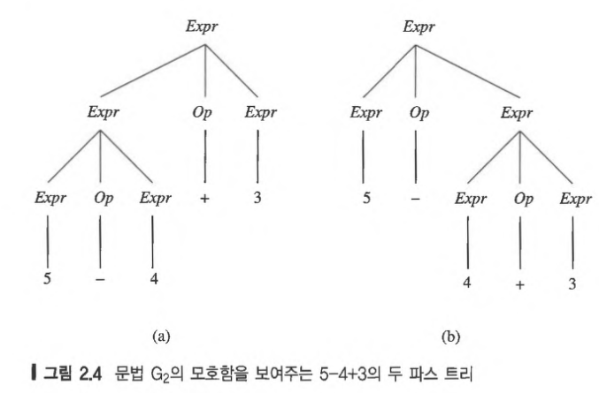
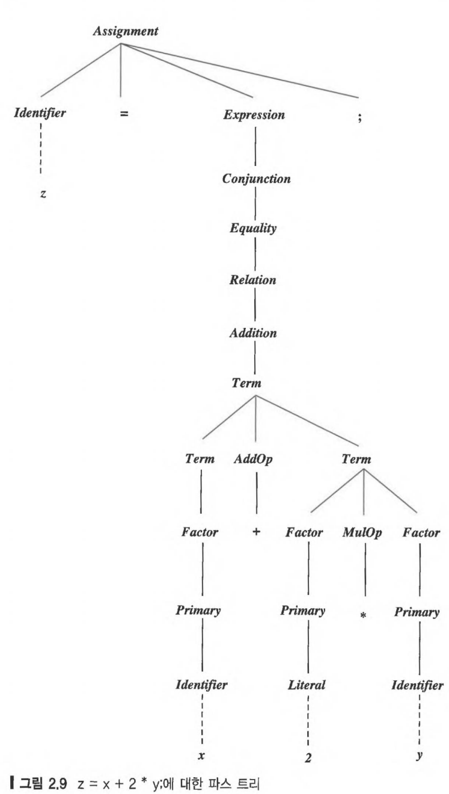

# 2.Syntax

프로그램은 (**how to write?**) 생김새와 (**what kind of results if run?**) 뜻으로 나눈다. 일반적으로, 프로그램의 생김새는 **syntax** 라고 하고, 프로그램의 뜻은 **semantics** 라고 한다.  컴파일러는 프로그램에서 syntax error 와 type 및 선언 오류를 찾아내는 반면, 컴파일러가 찾아내지 못하는 0으로 나누기 같은 runtime error는 본질적으로 semantic error 다.

> 프로그래밍 언어의 **syntax** 는 문법적으로 맞는 모든 프로그램을 정확하게 기술한 것이다.

`syntax` 는 자연어의 경우와 마찬가지로 문법규칙의 집합으로 기술할 수 있다. 프로그램에서 syntax specification 이 없으면 컴파일러 작성자와 프로그래머들이 작업을 재대로 하기 힘들어진다.

`syntax`를 정의하는 정형적인 방법은 60년대 초 ALgol 에서 사용되면서 등장한 이래, 대부분 언의의 `syntax` 를 정의하는데 사용되고 있다. 

프로그래밍 언어의 `syntax` 는 어휘(lexical), 구체(concrete), 추상(abstract)  단계로 나누어 정의하는 정형적 방법 및 비정형 방법이 있다.

> **lexical syntax** : 식별자, 리터럴, 연산자, 구두점에 대한 규칙을 정의한다.
>
> **concrete syntax** : 어휘 기호를 알파벳으로 사용하여 프로그램을 실제로 표현할 수 있는 규칙을 정의한다.
>
> **abstract syntax** : 구두점이나 괄호와 같은 구문 인식 전용 구문을 제외한 핵심적인 프로그램 구문 정보만 가지고 있다.
>
> - C : if (expr) ... discard()
> - Ada : if (expr) then discard then

## 2.1 Grammar

언어의 `syntax` 는 `grammar` 라고 하는 형식으로 대부분 명세할 수 있다. 문법은 `meta language` 로 작성되며, 구문적으로 유효한 프로그램을 작성할 수 있는 합당한 string 을 정의하는 것이다.

> A *grammar* is a metalanguage used to define the syntax of lanugage

`grammar` 는 Noam chomsky(노암 촘스키) 가 4계층으로 분류하여 개발한 형식 이론을 기반으로 한 `meta language` 다.

- regular
- context-free
- context-sensitive
- unrestricted

> **context-free grammar** 은 생성 규칙 : $P$ , 단말자 기호 집합 : $T$, $w$  , 비단말자 기호 집합 : $N$, 시작 기호: $S,S\in N$ 로 구성된다.
>
> **production** 은 $A \to w$  의 형태이다.   $A \in N$, $w \in (N \cup T)^\ast$  

BNF 는 **context-free grammer** 를 표현하고, 이는 프로그래밍 언어의 `syntax`를 정의하는데 널리 사용되어 왔다.

### 2.1.1 BNF Grammar

1960년 존 백케스와 피터 나우어가 촘스키 이론을 기초로 BNF를 만들어내었다. 대부분 문헌에서 그렇듯이 **BNF Grammar** 이라는 용어를 **context-free grammar** 의 동의어로 차별없이 사용한다.

$P$ 는  **문장형식(sentinel-form)** 이라고 하는 기호 스트링을 적용할 수 있는 재작성 규칙이다. 비단말자 $A$ 는 문장형식이 있는 $w$ 와 대체될 수 있다.  기호 $A$를 $P$ 의 **좌변 (left-hand side)** 이라고 하고, 스트링 $w$ 를 **우변(right-hand side)** 이라고 한다. BNF 문법에서 단말자와 비단말의 집합은 공통되는 부분이 없다.

BNF 문법을 프로그래밍 언어의 `syntax` 를 정의하는데 쓰는 경우 $N$ 은 Identifier, Integer, Expression, Statement, Program 과 같은 언어의 문법 카테고리를 나타낸다.  $S$ 는 (여기서는 Program) 문법으로 정의된 으뜸 문법 카테고리를 가리키고, 보통 첫 $P$ 로 정의된다. $T$는 프로그램을 구성하는 기본 알파벳으로 이루어진다.

```
binarydigit -> 0
binarydigit -> 1
```

위 $P$ 쌍은 *binarydigit* 가 0 아니면 1이고, 다른건 아니라고 정의한다. $N$ 은 최소한 하나의 $P$ 좌변에 나타나는 기호이다. 위 문법에서 *binarydigit* 은 유일한 $N$ 이다. $w$ 는 $P$ 에서 나오는 그 이외의 모든 기호이다. 위 문법에서는 0 과 1 이 $w$ 이다.

$P$ 에서 좌변이 모든 같은 $N$ 일 경우, 하나의 $P$ 로 합할 수 있다. 예를 들어 위 두 $P$ 는 다음과 같이 줄일 수 있다.

```text
binarydigit -> 0 | 1
```

이 경우 or 나 양자택일을 의미하는 수직선(|) 로 분리한다. 위 예에서 `->` 나 `|` 는 정의하는 언어에 속해있는 기호가 아니므로 **meta symbol** 이라고 한다.

BNF 의 $P$ 의 우변은 $N$ 과 $w$ 를 나열할 수 있어서 관심있는 다양한 구조를 간결하게 정의할 수 있다. 문법 카테고리 *Integer* 를 십진수 *Digits* 의 나열로 정의하는 다음 BNF 문법 $G_{integer}$ 는 다음과 같다.
$$Integer \to Digit \ | \ Integer \ Digit$$
$$Digit \to 0 \ | \ 1 \ | \ 2 \ | \ 3 \ | \ 4 \ | \ 5 \ | \ 6 \ | \ 7 \ | \ 8 \ | \ 9 $$

위 에서 두번째 $P$ 에서 일반적인 십진 숫자를 정의한다. 첫번째 $P$ 에 따르면, *Integer* 는 *Digit* 만 나오거나,  *Integer* 가 나오고 그 뒤에 *Digit* 가  나온다.  이 $P$ 의 두번째 선택($Integer \: Digit$) 은 **재귀적으로 정의되었으므로 임의로 긴 기호의 나열을 정의 할 수 있다.** 결론적으로 이 $P$ 는 *Integer* 를 하나 이상의 숫자의 나열로 정의한다.

> BNF 는 Algol60 의 **syntax** 를 정의하는데 전용으로 사용되는 **meta language** 로 시작했다. $N$ 는 각진 괄호를 이름에 둘러싸아 표시했는데, 최소한 하나의 $P$ 의 좌변에 나타났다. **meta language** 인 `:` 와 `|` 를 제외한 다른 기호는 모두 $w$ 취급 되었다.
>
> 따라서 Integer에 대한 문법은 BNF로 다음과 같이 표현하였다.
>
> ```text
> <integer> ::= <digit> | <integer>  <digit>
> <digit> ::= 0 | 1 | 2 | 3 | 4 | 5 | 6 | 7 | 8 | 9
> ```
>
> 오리지날 BNF 표기법은 그 당시의 제한된 입력 문자 집합에 맞추도록 설계되었지만, 컴퓨터 기술이 발전하면서 더 표현력이 좋은 표기를 만들어 낼 수 있는 표준 입력 장치를 사용하게 되자, 표기를 더이상 제한할 필요가 없어졌다. 

### 2.1.2 Derivations

특정기호 스트링이 어떤 문법적 카테고리에 속하는지 알아보려면, 그 카테고리의 $P$ 를 사용하여 그 스트링을 유도해보면 된다. 예를 들어 $352$ 가 $Integer$ 카테고리에 속하는지 알아보고 싶다면, 그 문법의 $P$ 를 사용하여 다음과 같이 이 스트링을 유도할 수 있다.

1. 먼저, 시작 기호인 $Integer$ 를 적는다.  

$$Integer$$

2. 첫 번째 $P$ 의 우변 두 번째 선택 규칙을 적용하여 $Integer$ 를 $Integer \ Digit$ 로 바꾼다.

$$Integer \Rightarrow Integer \ Digit$$

3. 같은 규칙을 다시 한번 적용하여 이 스트링의 $Integer$ 를 $Integer \ Digit$ 으로 바꾸면, $Integer \ Digit \ Digit$ 이된다.

$$Integer \ Digit \Rightarrow \ Integer \ Digit \ Digit$$ 

4. 이번에는 첫번째 $P$ 의 우변 첫 번째 선택 규칙을 적용하여 이 스트링의 $Integer$ 를 $Digit$ 으로 바꾸면, $Digit \ Digit \ Digit$ 이된다.

$$Integer \ Digit \ Digit \Rightarrow \ Digit \ Digit \ Digit$$

5. 두 번째 $P$ 를 적용하여 Digit 을 차례대로 3 , 5 , 2 를 유도해낸다.

$$Digit \ Digit \ Digit \Rightarrow \ 3 \ 5 \ 2$$

> You know you're finished when there are **only $w$ remaining**

기술적으로, `derivation` 은 **매 단계마다 $N$ 하나가 $P$ 의 우변으로 바뀌면서 새로 만들어지는 스트링은 $\Rightarrow$ 기호를 사이에 두고 나열된다.** 맨 앞에는 유도할 문법 카테고리가 오고, 맨 뒤에는 유도된 스트링이 온다. 

$\Rightarrow$ 표시는 **$P$ 를 한번 적용하여 유도하려고 하는 스트링에 한 단계 더 가깝게 바꾸었음을 나타낸다.** 유도 과정에서 나타나는 $w$ 와 $N$ 가 모두 포함된 유형의 스트링을 **문장 형식(sentiential form)** 라고 한다.예를 들어, $3 \ Digit \ Digit$ 문장형식은 5 번째 단계에서 나타난다.

따라서 방금 유도한 스트링 352는 문법 $G_{Integer}$ 의 문법 카테고리 $Integer$ 의 하나의 사례이다. 이 `derivation` 은 $352$ 라는 스트링이 유도될 수 있다는 증명이 되며, 아래와 같이 표시한다.

$$Integer \Rightarrow^\ast \ 352$$ 

즉, $352$ 스트링은 $Integer$ 라는 문법 카테고리에서 부터 시작하여, 0번 이상의 유도과정을 거쳐서 유도되었다. $\Rightarrow^\ast$  기호는 클레이니(Kleene) 별 표기법의 사례인데, 여기서 **$^\ast$ 표시는 그 왼쪽의 심볼이 (이 경우에는 유도 심볼인 $\Rightarrow$ 가) 0번 이상 나타난다는 표시로 사용된다.**

> BNF 문법 $G$ 로 정의한 **언어(language) $L$** 은 그 $S$ 로 부터 유도될 수 있는 모든 $w$ 의 집합이다.

문법 $G_{integer}$ 로 정의한 언어는 십진수 숫자를 유한하게 나열한 모든 스트링의 집합으로, 구문 카테고리 $Integer$ 를 구성한다. 스트링 $352$ 는 $G_{integer}$ 의 $P$ 로 유도할 수 있기 때문에 이 언어의 멤버중 하나이다. 위에서 본 유도는 각 유도 단계마다 문장 형식에서  가장 왼쪽 $N$ 를 문법의 우변 중의 하나를 선택하여 바꾸므로 **왼쪽 우선 유도(leftmost derivation)** 라고 한다. 다른 순서로 유도를 하는 것도 가능하다. 예를 들면, 각 유도 단계마다 가장 오른쪽 $N$ 를 바꿀 수도 있는데, 그 경우 **오른쪽 우선 유도(rightmost derivation)** 라고 한다. 즉, 다음과 같이 유도된다.

$$Integer \ \Rightarrow \ Integer \ Digit$$

$$\ \ \ \ \ \ \ \ \ \ \ \ \ \ \Rightarrow \ Integer \ 2$$

$$\ \ \ \ \ \ \ \ \ \ \ \ \ \ \Rightarrow \ Integer \ Digit \ 2$$

$$\ \ \ \ \ \ \ \ \ \ \ \ \ \ \Rightarrow \ Integer \ 5 \ 2$$

$$\ \ \ \ \ \ \ \ \ \ \ \ \ \ \Rightarrow \ Digit \ 5 \ 2$$

$$\ \ \ \ \ \ \ \ \ \ \ \ \ \ \Rightarrow \ 3 \ 5 \ 2$$

### 2.1.3 Parse Trees

어떤 BNF 문법으로 정의된 언어의 특정 스트링이 속하는지 보여주는 또 다른 방법은 그림 형식으로 `derivation` 을 그려보는것이다. 이를 `parse tree` 라고 한다.

`pares tree` 형식에서, 유도의 한 단계는 하위 트리를 하나 새로 만들어 나가는것에 해당한다. 다음 유도의 단계에 대해서

$$Integer \Rightarrow \ Integer \ Digit$$

하위 트리는 아래와 같이 만들어 나간다.


각 하위 트리의 루트는 유도에서 비단말자에 해당하는 노드이고, 바로 아래 자식노드는 좌에서 우 순서대로 사용된  $P$ 의 우변에 해당된다.

스트링 $352$ 의 유도로 완성된 `parse tree` 는 다음과 같다. 일단 **`parse tree` 가 완성되면 유도 순서는 알 수 없다.** 왼쪽 우선으로 유도하든지 오른쪽 우선으로 유도하든지 결과 트리의 모양은 같다.


`parse tree` 는 특징은 다음과 같다.

1. `parse tree` 의 루트 노드는 항상 문법의 $S$ 로 구성된다.
2. 내부 노드는 모두 $N$ 로 구성된다. 내부 노드의 개수는 유도 단계($\Rightarrow$)의 개수(위 예에서는 6) 와 항상 같다.
3. 각 내부 노드의 바로 아래 후손노드는 문법 규칙의 우변에 나타난 요소들을 왼쪽에서 오른쪽의 순서로 나열되어 구성된다.
4. 리프 노드는 항상 문법의 $w$ 이다. 리프 노드를 왼쪽에서 오른쪽으로 읽으면 파스된 스트링이 재구성된다.

> - Each internal node of the tree corresponds to a step in the derivation
> - Each child of a node represents a right-hand side of a production
> - Each leaf node represents a symbol of the derived string, reading from left to right

요약하면, **유도는 `parse tree` 의 간단한 선형 표현**이고, 유도되는 스트링이 원하는 문법구조를 가지지않은 경우 더 도움이 된다. 문법 구조가 더 복잡해질 경우 파스 트리를 사용하는 편이 더 낫다.

연산자 `+` 와 `-`, `피연산자` 로 한 자리수의 정수를 가질 수 있는 계산식 언어를 정의하는 아래 문법 $G_{0}$ 은 다음과 같다.

$$Expr \rightarrow \ Expr \ + \ Term \ | \ Expr \ - \ Term \ | \ Term$$

 $$Term \ \rightarrow \ 0 \ | \ . . . \ | \ 9 \ | \ (Expr)$$

문법 $G_{0}$ 로 스트링 $5-4+3$ 에 대한 `parse tree` 는 다음과 같다.


이 트리에서 리프노드를 왼쪽에서 오른쪽으로 나열된 계산식은 $(5-4)+3$  으로 작성된 것 처럼 해석하고, $5-(4+3)$ 를 계산하는 경우와 다른 결과가 나올 것이다. 연산자 `+` 의 왼쪽 피연산자는 $Expr$ 이고, 이는 다음에 스트링 $5-4$ 를 유도한다. 비슷하게 연산자 `+` 의 오른쪽 피연산자는 $Term$ 에서 유도되어 스트링 $3$ 이 된다.

### 2.1.4 Associativity and Precedence

2.1.3절에서 보았듯이 `parse tree`구조는 유도된 스트링의 의미를 해석하는데 도움이 된다. 이제는 계산식에서 연산자의 `Associativity(결합성)` 과 `Precedence(우선순위)` 를 정의하는데 문법 구조가 어떻게 사용되는지 알 필요가 있다.

> **정의** : 어떤 연산자가 다른 연산자보다 `precedence` 가 높으면, 해당 연산자만 포함되어 있으며 괄호가 없는 계산식에서는 전자가 더 먼저 계산되어야 한다.
>
> **정의** : `associativity` 는 `precedence` 가 같은 연산자가 왼쪽부터 결합(좌결합) 하여 계산할지, 오른쪽부터 결합(우결합) 하여 계산할지를 정한다.

그림 2.2 를 보면 `+` 와 `-` 는 트리의 모양을 결정하는 데 전혀 영향을 미치지 않는다. 스트링 $5+4-3$ 에 대한 `parse tree` 를 그려보면  **`+` 와 `-` 의 위치만 바뀔 뿐 트리 모양은 같다. 이 사실로 `+`  와 `-`  의 `precedence`는 같다고 결론지을 수 있다.**  문법을 보면 `+` 와 `-` 가 $Expr$ 정의에서 양자택일 하게 되어 있으므로 당연하다.

더구나 문법 $G_{0}$ 의 $Expr$  $P$ 에서  **재귀가 왼쪽에서 일어나므로 이 연산자들은 좌결합이다. 재귀가 오른쪽에서 일어나도록 문법이 정의되어 있었다면 연산자는 우결합이었을 것이다.**

이러한 직관을 가지고 다양한 이항 연산자를 가진 문법 $G_{1}$ 을 정의해보면,

$$Expr \rightarrow \ Expr \ + \ Term \ | \ Expr \ - \ Term \ | \ Term$$ 

$$Term \rightarrow \ Term \ * \ Factor \ | \ Term \ / \ Factor \ | \ Term \ \% \ Factor \ | \ Factor$$ 

$$Factor \rightarrow Primary  \ ** \ Factor \ | \ Primary$$

$$Primary \rightarrow \ 0 \ | \ ... \ | \ 9 \ (Expr)$$​

`precedence` 는 $S$ 에서 연산자까지의 가장 짧은 유도 길이에 의해서 결정되고, `associativity` 는 재귀를 어느 쪽으로 하느냐에 따라서 결정된다. 문법 $G_{1}$ 의 성질은 다음과 같다.


문법 $G_{1}$ 에 가지고 $4**2**3+5*6+7$​ 에 대한 `parse tree` 를 그려 놓은 그림을 보면 이 `parse tree` 는 다음과 같이 괄호친 것처럼 계산 식을 계산하였다.

$$((4**(2**3))+(5*6))+7$$


이 `parse tree` 를 보면 지수 연산자는 분명히 우결합이다. 이 트리를 보면 지수와 덧셈, 그리고 덧셈과 곱셈 연산자들의 사이의 `precedence`도 알 수 있다. 문법 $G_{1}$ 를 가지고 $4**2**3+5*6+7$ 스트링으로부터 **유도 해 낼 수 있는 `parse tree` 는 이 모양밖에 없다.** $Expr$ 를 루트로 시작하여 문법 $G_{1}$ 를 가지고 다른 방법을 시도해서 다른 모양의 트리를 만들면 절대로  $4**2**3+5*6+7$ 가 나오지 않음을 증명 할 수있다.

프로그래밍 언어가 결합성과 우선순위 원칙을 동일하게 가져갈 필요는 없다. SmallTalk 경우 산술 연산자는 우선순위 없이 모두 좌결합이고, APL 연산자는 우선순위 없이 모두 우결합이다.

### 2.1.5 Ambiguous Grammars

문법을 설계할 때, 두 가지 이상으로 해석할 수 있는 모호한 명세는 피하는 것이 중요하다.

> 문법이 **모호(ambiguous)** 하면, 그 문법이 만들어 내는 언어는 최소한 두 개 이상의 다른 모양의 **parse-tree** 가 만들어지는 스트링이 존재한다.

문법이 모호해지는걸 피하는 것이 좋지만, 규칙의 개수를 현저하게 줄일 수 있으면 특히 모호성이 용인되는 경우가 있을 수도 있다.

다음은 문법 $G_{1}$ 를 모호하게 만든 $G_{2}$ 이다.

$$Expr \rightarrow \ Expr \ Op \ Expr \ |  \ (Expr) \ Integer$$

$$Op \rightarrow + \ | \ - \  |  \ * \ | \ / \ | \ \% \ | \ **$$

 이 문법에 표 2.1를 적용하여 모호성을 제거할 수 있다. 

이러한 문법은 새로운 연산자가 추가되면 새로운 문법 규칙 하나가 늘어날 뿐이다.  C, C++, Java 와 같은 언어에서는 `precedence level` 이 깊고, 연산자 수가 많아 문법이 방대해진다. 우선순위를 문법에 집어넣어 정의하는 대신, 문법은 모호하게 만들면서 우선순위와 결합성을 표 2.1과 같은 형식으로 따로 명세할 수 있다. 

문법 $G_{2}$ 가 모호함을 보이기 위해서 모양이 다른 `parse tree` 가 두개 생기는 스트링을 찾기만 하면 된다. 문법 $G_{0}$ 의 언어는 문법 $G_{2}$ 의 언어의 부분집합임을 참고로 하여, 그림 2.4 의 $5-4+2$ 의 예와 같이 모양이 다른 파스 트리가 두 개 임을 보이면 된다. 각 트리를 계산해보면 왼쪽 트리는 4, 오른쪽 트리는 -2 라는 다른 결과가 나온다.



구문적 모호성을 보여주는 또 하나의 유명한 예로 **비대칭 선택문 문제(dangling else problem)** 가 있다. 다음의 문법 조각 $G_{if}$ 는 다음과 같다.

$$IfStatement \rightarrow \ if \ (Expresssion) \ Statement \ | \ if \ (Expression) \ Statement \ else \ Statement$$

$$Statement \rightarrow \ Assignment \ | \ IfStatement \ | \ Block$$

$$Block \rightarrow \{Statements\}$$

$$Statements \rightarrow Statements \ Statement \ | \ Statement$$

이 문법 규칙인 중첩된 $if$ 에 두 종류의 다른 $else$ 절을 붙일 수 있으므로 `dangling else problem` 를 야기시킨다는 사실을 알아채기는 그리 어렵지 않다. 다음 예를 볼때,

```java
if (x < 0)
    if(y < 0) y = y - 1;
	else y = 0;
```

문법 조각 $G_{if}$ 를 적용해보면, 두 개의 $if$  중에 어느 쪽에 $else$ 절을 붙여도 된다. 즉, 그림 2.5와 같이 모양이 다른 `parse tree` 를 두개 만들 수 있다.(점선은 생략된 `parse tree`) 

**여기서 $else$ 를 어느 $if$ 에 붙여야 하는지 결정하는 것이 이슈이다.** $else$ 절을 두 번째 $if$ 에 붙이는 경우, $x<0$ 이고 $y>=0$ 이면 $y$ 가 $0$ 이 된다. 그러나 $else$ 절을 첫 번째 $if$ 에 붙이는 경우, $x>=0$ 이면 $y$ 가 $0$​ 된다.


C와 C++ 같은 일부 언어 명세에서는 붙이는 기준을 글로 기술하여 모호성을 해결한다. 예를들어 모든 $else$ 절은 짝이 없는 가장 가까운 $if$ 문과 짝을 맞춘다. 다르게 짝을 맞추고 싶으면 중괄호$\{\}$ 를 반드시 끼워넣어야 한다. 예를 들어 첫번째 $if$ 문과 짝을 맞추기 위해서, 프로그래머는 다음과 같이 중괄호를 끼워 넣어야 한다.

```c
if (x < 0)
	{ if (y < 0) y = y - 1;}
else y = 0;
```

Java 에서는 $IfStatement$ 에 대한 BNF 문법을 확장하여 `dangling else problem` 를 흥미 있게 해결한다. Java 명세에서는 두 개의 다른 구문 카테고리인 $IfStatement$ 와 $IfThenElseStatement$ 로 문법정의를 나눈다. 이 둘은 모두 다 일반 카테고리인 $Statment$ 의 하위 카테고리가 된다.

$$IfThenStatement \rightarrow \ if \ (Expresssion) \ Statement$$

$$IfThenElseStatement \rightarrow \ if \ (Expresssion) \ StatementNoShortIf \ else \ Statement$$

$StatementNoShortIf$ 는 $IfThenStatements$ 를 제외한 모든 문장을 포함하지만, 다른 $IfThenElseStatements$ 는 포함할 수 있다. 이 조항은 $IfThenStatements$ 가 $else$ 절 앞에 첫 번째 선택문이 되는 것을 배제하여 $else$ 절이 프로그램에 나타나면 어떻게 짝을 지워야 할지에 대한 모호성을 제거한다. 만약 이 $IfThenElseStatement$ 안에 다른 $if$ 문이 중첩된다면, 반드시 $else$​ 절 짝이 있어야 한다.

`dangling else problem` 의 세번째 해결 방법은 **선택문, 루프, 함수 선언, 프로시저 선언과 같이 선천적으로 중첩된 구조는 각각 유일한 키워드로 끝내도록 하는 것**으로 Algol-68에서 유래하였다. Algol-68 의 관례는 닫는 키워드는 여는 키워드를 거꾸로 적는 방식이었다. 따라서 if 문은 모든 else 절이 있든지 없든지 상관없이 키워드 fi 로 끝나야 했기 때문에 `dangling else problem` 는 자연히 해결되었다. 예를 들어 그림 2.5에서 보여준 모호성을 Algol-68 프로그래머는 다음의 둘중 한 방식으로 해결 할 수 있었다.

```asp
// 1
if (x<0)
      if (y<0)
      	y := y-1;
      else y := 0;
      fi
fi
      
// 2
if (x<0)
      if (y<0)
      	y := y-1;
      fi
else y := 0;
fi
```

## 2.2 Extended BNF

Algol60 이후, 프로그래밍 언어의 `syntax` 는 BNF  와 유사한 방식으로 명세되고 있다. 다양한 variation 들이 등장했지만 기본적인 BNF 표현에는 변화가 없었다. variation 은 주로 `syntax` 의 명세와 명료성과 간결성을 향상시키기 위해 등장하였다.

> {} : for a series of zero or more.
>
> () : for a list, must pick one.
>
> [] : for an optional list; pick none or one.

**확장BNF(EBNF)** 는 반복, 옵션, 선택을 표한하는 메타기호를 추가하여 문법을 더 간단하게 작성할 수 있도록 한것이다. 다음 BNF 문법 $G_{0}$ 을 보면,

$$Expr \rightarrow Expr \ + Term \ |  \ Expr \ - \ Term \ | \ Term$$

$$Term \rightarrow | \ 0 \ | \ ... \ | \ 9 \ | \ (Expr)$$

이 문법 규칙의 첫줄은 `+` 혹은 `-` 기호가 사이에 낀 항($Term$) 의 하나 이상 나열(리스트)을 계산식($Expr$) 으로 정의한다. 이를 **EBNF** 로 다음과 같이 정의하면, 위 규칙에서 나타나는 왼쪽 재귀가 없어진다.

$$Expr \rightarrow \ Term \ \{ \ ( \ + | - \ )  \ Term\}$$

이 규칙에서 `()` 와 `{}` 는 메타기호이다. 

**EBNF** 를 사용하여 복잡해진 점은, 중괄호, 괄호, 대괄호 같은 기호를 메타기호로 사용하는 경우와 단말자로 사용되는 경우를 구별해야 하는것이다. 이를 구별하기 위해 여러 제안이 있었지만, 최근에는 단말자 기호를 다른 폰트로 쓰는게 관례이다. 단말자는 (위 문법의 (, ), +, -) 너비가 고정된 폰트로, 메타기호는 (오른쪽 화살표를 제외하고) 굵은 폰트를 쓰는 관례를 쓴다.

2.1.5 절의 문법 $G_{if}$ 를 **EBNF** 버전으로 바꾸면 대괄호 메타기호의 예를 볼 수 있다.

$$IfStatement \rightarrow if \ ( \ Expression \ )  \ Statement \ [ \ else \ Statement \ ]$$

이 규칙은 다음과 같이 읽으면 된다.

$IfStatement$ 는 단말자 if, 다음에 괄호로 둘러싸인 $Expression$ , 다음에 $Statement$ , 다음에 단말자 else 와 $Statement$ 가 연속해서 나오는 옵션인 else 부분으로 정의된다. 2.1.5 절의 해당 문법과 마찬가지로 이 문법도 모호하다.

**EBNF**로 정의한 언어의 `syntax` 가 BNF 정의에 비해 간단하고 명료하다. **특히, 프로그래밍 언어의 `syntax`  를 정의할 때 반목 나열(리스트)이 필수적인데, BNF를 쓰면 이를 재귀적으로 정의해야 하지만, EBNF를 쓰면 굳이 재귀정의를 하지 않아도 된다.**

C 스타일 **EBNF** `variation` 은 여러 언어에서 정의하는데 사용되었다. 이 표기법의 명세는 스토르스트럽이 다음과 같은 식으로 작성하였다.

> `syntax` 의 카테고리는 이탤릭체로, 리터럴 단어와 문자는 너비가 일정한 표시로 표시한다. 선택 항목들은 여러 개를 한 줄에 나타낼 수 있는 경우를 제외하고 "one of" 라고 표시하고 한 줄에 하나씩 나열한다. 옵션이 되는 단말자나 비단말자는 $opt$ 라는 첨자를 붙여서 표시한다.

" $opt$ " 라는 첨자는 여러 개의 단말자와 비단말자 기호를 같이 묶어서 옵션으로 처리할 수 있는 능력을 가진 메타기호인 `[]` 에 해당한다. 따라서 $G_{y}$ 를 이 표기법으로 표현하면 다음과 같다.

$$Ifstatement \ : $$

$$\ \ \ if \ ( \ expression \ ) \ statement \ elsepart_{opt}$$

$$elsepart \ :$$

$$\ \ \ else \ statement$$

 또 하나의 `variation` 은 Pascal 언어의 `syntax` 정의에서 사용되어 유명해진 **구문 다이어그램(syntax diagram)**  이다. 그림 2.6에 다수의 덧셈과 뺄셈 연산자가 포함된 계산식($Expression$) 을 구문 다이어그램으로 어떻게 그리는지 예를 보여주고 있다.


이 다이어그램은 왼쪽에서 오른쪽으로 방향으로 읽고, 오른쪽 화살표로 가는 모든 경로를 합법적인 $Expression$ 으로 정의한다. 즉, $Expression$ 은 `+` 또는 `-` 로 분리된 하나 이상의 $Term$ 의 나열 또는 리스트이다.

**EBNF** 나 구문 다이어 그램으로 언어의 `syntax` 를 정형적으로 기술한다고 해서 **BNF 보다 표현력이 더 풍부해지지는 않는다.** 예를 들어 $A$ 를 비단말자, $x, y, z$ 를 단말자와 비단말자의 임의적인 나열이라고 하자. 다음과 같은 모양의 메타 중괄호가 포함된 **EBNF** 규칙은

$$A \rightarrow x \ \{ y\} \ z$$

메타 중괄호 없이 다음과 같이 변형할 수 있다.

$$A \rightarrow \ xA'z$$

$$A' \rightarrow \varepsilon \ | \ yA'$$

여기서 $A'$ 는 유일한 새로운 비단말자이다. $A'$ 는 규칙에서 빈 문자열 $\varepsilon$ 이 들어있는 첫 번째 선택규칙은 $A'$​ 대신 빈 문자열로 대체할 수 있다는 의미이다. EBNF 규칙에서 메타기호 `()`, `[]` 를 제거하는데 필요한 전략도 이와 유사하다.

따라서 **EBNF**는 BNF 보다 규칙이 더 간단해지므로 언어의 `syntax` 를 기술하는데 자주 사용된다. 

## 2.3 Syntax of a Small Language: Clite

`Clite` 는 C와 유사한 소규모 언어이고, 프로그래밍 언어 전체의 `syntax` 를 기술하는 기초의 핵심만을 이해하는데 적절한 언어다.

$G_{Clite}$ 라고 하는 Clite 전체 문법은 그림 2.7에 정의되어 있다. 이 문법은 표 2.2에서 볼 수 있듯이 실전에서 사용하는 언어들의 문법에 비하면 규모가 훨씬 적다.


문법 $G_{Clite}$ 로 다양한 구문 구조를 잘 제시할 수 있지만,다음과 같은 구문 관련 이슈는 뺏다.

- Comments
- Whitespace
- Distinguishing one token <= from two tokens < =
- Distinguishing identifiers from keywords like if

문법 $G_{Clite}$ 는 `lexical level` 과 `syntatic level` 의 두단계로 구분된다. 

### 2.3.1 Lexical Syntax

그림 2.7의 $Identifier$ 의 정의에서 시작하여 마지막 여덟 개 문법 규칙은 어휘 이슈를 다룬다. $Identifier$ 와 다양한 형태의 $Literal$ 의 `syntax` 를 정의한다. 문법 $G_{Clite}$ 의 앞 23개 $P$ 에서 정의되는 키워드와 다른 단말자 기호들도 `lexical level` 에 속한다.

**Lexical Syntax** 에서 취급하는 문자는 NULL 문자(ASCII = 0), 탭 문자(ASCII = 9)를 제외한 제어문자(ASCII 코드 1-26), DEL 문자(ASCII 코드 127), 그리고 127보다 큰 코드번호에 해당되는 문자를 제외하고, 프린트 가능한 ASCII 문자의 집합이다. **어휘 구문으로 유도가능한 단말자 문자열을 토큰(token)** 이라고 하고, 다음과 같은 그룹으로 나눈다.

- Identifier : Stack, x, i, push
- Literal : 123, 'x', 2.35, true ....
- Keyword : bool, char, else, false, float, if, int, main, true, while, ....
- Operator : =, ||, ==, >, <, +, *, !, / ....
- Punctuation : ;, {}, ()

일반적으로 토큰은 공백문자(white space)를 포함하지 않는다. 공백문자는 space, tab, the end of line, comments 를 일컫는다. 

> No token may contain embedded whitespace (unless it is a character or string literal)
>
> Example : `>=` one token, `> =` two tokens

다음 Pascal 프로그램 Fragment를 보자.

```pascal
while a < b do
```

여기서 keyword `while` 과 식별자 `a`  사이와 와 `b`  와 keyword `do` 사이에 공백문자가 필요하다. 그러나 a 와 < 사이나 < 와 b 사이에 공백문자를 끼워 넣을 필요는 없다.

> while a < b do // legal - spacing between tokens
>
> while a<b do // spacing not needed for <
>
> whilea<bdo // illegal - can't tell boundaries
>
> whilea < bdo // between tokens

문맥과 상관없이 유효한 토큰을 구성하는 가장 긴 문자열을 찾는 greedy 알고리즘을 사용하여 컴파일러는 토큰을 분석해낸다. 위 에서 `while` 뒤에 공백문자 없이 `whilea` 로 쓰면, 비록 그런 변수를 선언하지 않고 `while a <` 가 유효한 문장의  앞부분이 될 수 없더라도 유효한 $Identifier$ 토큰으로 인식한다. 반대로 `a<` 는 유효한 토큰이 아니지만, `a` 와 `<` 는 따로 유효한 토큰이 된다. 따라서 이 두 문자 사이에 공백문자는 필요없다.

주석의 구문 구조는 문법 $G_{Clite}$​ 에서 정의하지 않으며, 따로 정의한다. Clite 는 C++의 관례에 따라 `//`  주석을 사용한다.

$Identifier$ 는 문자(A-Z, a-z) 와 숫자(0-9) 로 구성되며, 문자로 시작한다. 따라서 이 정의에 따르면 문자열 if 는 $Identifier$ 도 되고,  $Keyword$ 도 된다. **그러면 Identifier 와 Keyword는 어떻게 구별할까? 대부분의 언어에서 Keyword 는 모두 예약어로 취급한다.** 즉 그렇게 되면 **식별자와 예약어와 철자가 같을 수 없다.** Clite 는 이 관례에 따라 예약어를 다음과 같이 정한다.

```clike
bool else float int true char false if main while
```

C 나 C++ 에서 main 은 $Reserved Keyword$ 가 아님을 주목하자. 대신 프로그램의 실행이 시작되는 함수의 이름을 가르키는 특수 $Identifier$ 이다.

프로그래밍 언어마다 $Identifier$ 나 $Keyword$ 를 정의하고 표현하는 방식은 서로 다르다. 

- float 리터럴 `5.` 은 합법적인가?
- 식별자는 case-sensitive 하는가?

### 2.3.2 Concrete Syntax

프로그램 전체의 `syntax` 는 프로그램의 토큰 나열을 가지고 문법에서 유도해낸 트리이다. 프로그램의 `concrete syntax` 는 해당 문법의 시작 비단말자로 시작하여 토큰 나열을 parse 한 트리를 나타낸다. 

> Based on a parse of its Tokens

예를 들어, Clite 프로그램에 대한 parse tree 의 루트는 구문 카테고리 $Program$ 이며, main, $Declarations$ 의 하위 트리, $Statements$ 의 하위 트리를 포함하고 있는 일련의 토큰들을 바로 아래 후손으로 가지고 있다.

Algol과 Pascal 같은 언어는 세미클론 `;` 을 문장의 separator 로 사용하는데 비해서, C와 유사한 언어들은 선언과 문장의 terminator 로 사용한다. $Block$ 문장만 세미클론으로 끝나지 않고 오른쪽 중괄호로 끝난다.

Clite는 $IfStatement$ 규칙은 비대칭 선택문 문제 때문에 문법이 모호하다. 이 문제는 다음과 같이 해결한다.

> 비대칭 선택문 모호성은 else 없는 가장 가까운 if 와 해당 else 를 연결하여 해결한다.

이 외에 그림 2.7의 Clite 문법에 모호한 규칙은 없다.

Clite 상세 구문은 계산식에서 사용하는 다양한 연산자를 정의하고 있다. 메타 중괄호는$Addition$ 규칙에서와 같이 다양한 우선순위 level 에서 사용되며, 좌결합을 암시한다. 메타 대괄호(옵션)는 $Equality$ 와 $Relation$ 규칙에 사용되어, $EquOp$ 과 $RelOp$ 연산자는 결합법칙이 필요 없다. 메타 괄호는 그림  2.7의 문법에는 사용되지 않았다.

그림 2.7의 문법의 중간 부분은 7가지 수준의 우선순위와 관련 연산자와 결합성을 모호하지 않게 정의하는 데 할애하고 있다. 

모호하지 않은 계산식의 하위 문법을 사용하더라도 계산식 연산자의 우선순위와 결합성은 표로 따로 명세해주면 이해를 증대하는데 도움을 준다. 표 2.3에 Clite 연산자의 우선순위를 감소하는 순으로 나열해놓았다.


Clite 는 동등 연산자도 관계 연산자도 `asscociativity` 가 없는데, 이는 Ada 에서 빌려온 아이디어다. C/C++ 에서는 다음과 같은 계산식을 사용할 수 있다.

```c
if (a < x < b) // not equivalent to (if a < x && x < b)
```

이 식은 `x` 가 경계값을 포함하지 않고, a 와 b 사이에 있는 값인지 검사한다. 그러나 문제는 b > 1이 되기만 하면, 이 계산식은 무조건 `true` 가 된다. 이유는 a  <  x 는 언제나 0 또는 1 값을 갖기 때문이다. 따라서 이 연산자의 결합성을 부여하도록 결정한 설계는 의문의 여지가 있다.

## 2.4 Compilers and Interpreters

컴파일러의 논리적 구조는 그림 2.8과 같다. 그림의 각 상자는 아래에서 설명하듯이 소스 프로그램을 다른 언어의 프로그램(코드) 으로 변환하는 과정으로 구성되어 있으며, 논리적으로 밀접하게 연관이 있는 계산의 단계(phase) 로 구분되어 있다.

**패스(pass)란 소스 프로그램 전체를 한번 훑어보는 것이다.** 대부분 컴파일러는 패스 한번으로 임무를 완수하지만, PL/I 컴파일러는 의미 분석과정에서 여러 번의 패스를 거치기도 한다. 그리고 컴파일러를 통한 성능향상도 여러 번의 패스를 거쳐서 이루어진다.


소스 프로그램의 최초 상태는 문자를 나열해 놓은 텍스트이다. **어휘 분석기 (lexical analyzer 또는 lexer)의 역할은 프로그램을 스캔하여 이를 토큰의 나열로 변환하는 것이다.** 이 변환의 과정에서 주석을 포함한 모든 공백문자는 버려진다. 그리고 유효한 토큰을 만들 수 없는 문자들도 오류 메시지를 생성한 후 버려진다.

어휘와 구문 분석 단계는 둘 다 문법에 근거하기 때문에, 어휘 분석을 따로 하는 이유는 설명하고 넘어갈 필요가 있다. 역사적으로 그 이유를 밝혀보면 다음과 같다.

1. 어휘 분석기의 설계는 구문 분석에 사용되는 문맥 자유 모델보다 훨씬 더 간 단하고 빠른 계산 모델을 기초로 하고 있다. 
2. 성능향상을 하지 않는 컴파일러에서는 컴파일하는 데 걸리는 총 시간의 약 75%가 어휘 분석하는 데 소모된다. 따라서 이 단계의 실행 속도를 향상하면 전체 컴파일 시간에 상당한 영향을 미친다.
3. ASCII가 생기기 전, 각 컴퓨터는 기종마다 사용하는 문자가 달랐다. 어휘 분석에서 이 문자 집합을 감추어주면 컴파일러를 새로운 컴퓨터에 이식하기 훨씬 쉬워진다. 오늘까지도 ASCII, Unicode, EBCDIC와 같은 상이한 문자 집합을 사용하므로 이 문제의 흔적은 여전히 남아 있다. 
4. 줄을 바꾸는 관례도 운영체제에 따라서 다르다. 예를 들어, (Mac OS/X 이 전의) 애플 매킨토시는 캐리지리턴(carrage return, ASCII 13)을 줄바꿈 문 자로 사용하고, Linux/Unix는 새줄(newline) 또는 줄넣음(linefeed) 문자 (ASCII 10)를 사용하고，Microsoft Windows는 캐리지리턴과 새줄 문자를 모두 사용한다. 다 그렇지는 않지만, 현대 언어의 대부분은 이 문제를 언어 의 실행시간 지원 라이브러리에서 처리한다. 초창기에는 그렇지 않아서, 이러한 운영체제의 차이점은 어휘 분석기 안에서 가려져 있었다.

컴파일러의 두 번째 단계는 파서 (parser) 또는 구문 분석 (syntactic analysis) 단계이다. **구문 분석기(syntactic analyzer)는 연속으로 나열된 토큰을 읽어서 문법 규칙에 따라 파스 트리를 구축한다.**  파서의 출력물은 그림 2.9와 같이 파스 트리가 될 수도 있고, 추상 구문 트리가 될 수 도 있다.



예로서 문법 $G_{Clite}$ 의 $Assignment$ 규칙을 가지고 파스 트리를 얻을 목적으로 입력 `z = x + 2 * y;`  를 파스(parse)해 보자.  $Assignment$  문법 규칙에 의하면 $Identifier$ 다음에 `-` 다음에 $Expression$ 다음에 `;` 가 온다. 이 문자열을 성공적으로 파스하려면 `z` 는 반드시 문법 카테고리 $Identifier$ 의 사례가 되어야 하고, `x + 2 * y` 는 반드시 카테고리 $Expression$ 의 사례가 되어야 한다. 따라서 그림 2.9에서 $Expression$ 을 뿌리로 하는 하위 트리는 다른 문법 규칙을 가지고 따로 구축해야 한다. 즉, 이 하위 트리를 구축하기 위해서 $Term, Factor, Primary$ 와 같은 규칙들을 추가적으로 사용해야 한다. 

컴파일러의 세 번째 단계는 **의미 분석(semantic analysis) 단계 또는 타입검사기(type checker)이다. 이 단계는 다음과 같이 언어의 컴파일 시간 의미 규칙을 시행하도록 확인하는책임이 있다.**

- 프로그램에서 쓰는 식별자는 모두 미리 선언해야 한다. 
- 각 연산자에 대하여 해당 피연산자는 타입이 맞아야 한다. 
- 타입을 변환하는 (예: 정수에서 부동소수점수로) 연산은 필요한 곳에 삽입해야 한다. 

컴파일시간 의미 규칙 중에서 어느 하나라도 위반하는 경우, 그에 적절한 오류 메시지가 생성되어야 한다. 이 단계의 출력물은 중간 코드(intemediate code, IC) 트리 이다. 중간 코드는 기본적으로 저수준으로 변환된 추상 구문 트리이다. 예를 들어, Clite에서 토큰 `+` 는 정수와 부동소수점수를 나타내는 데 중복 사용된다. IC 트리에서는 덧셈의 타입에 따라 다른 연산자를 사용할 수도 있다. 

컴파일러의 **코드 항상(Code optimization) 단계의 목적은 타겟 머신 구조를 기반으로 중간 코드의 성능을 향상시키는 데 있다.** 흔히 적용되는 코드 항상 방법으로는 컴파일 시간에 상수 계산식을 찾아 계산하고, 캐시 수행능력을 향상시키기 위하여 코드의 순서를 바꾸고, 공통 부분계산식을 찾아서 임시 저장장소의 참조로 바꾸는 등이 있다. 좋은 코드성능 향상기는 프로그램의 실행 속도를 꽤 향상시킬 수 있다. 

컴파일러의 마지막 단계는 **타겟 머신 코드를 구축하는 코드 생성(code generation) 단계이다. 이 단계는 어떤 기계 명령을 사용할 것인지, 레지스터 할당은 어떻게 할 것인지, 기타 기계에 종속된 여러 사항을 결정하는 책임이 있다.** 

컴파일러와 비교해서 **실행기(interpreter)는 컴파일러의 마지막 두 단계를 빼고 중간 코드를 직접 실행시키는 (또는 해석하는) 프로그램으로 대체한 점이 다르다.** Interpreter 에는 Pure Interpreter 와 Mixed Interpreter 의 두 종류가 있다. 순수 실행기(pure interpreter)는 각 문장을 실행할 때마다 토큰화하고, 파스하고, 의미 분석을 한 후 실행한다. 대부분의 Basic 번역기와 Bourne 웰과 같은 거의 모든 웰 명령 실행기 (shell command interpreter)는 순수 실행기이다. 반면 Perl과 같은 대부분의 스크립트 언어는 전체 스크립트(프로그램)를 실행 단위로 하나씩 중간 코드로 먼저 번역하고 더 이상의 번역 없이 중간 코드를 반복하여 실행하는 혼합 실행기(mixed interpreter) 방식을 취한다.

썬(Sun) 사의 Java JDK는 흔하지 않은 mixed Interpeter의 예이다. Java 컴파일러 javac는 Java 소스 코드를 바이트 코드(bytecode)라고 하는 중간 코드로 컴파일하고, 그 중간 코드는 자바 가상 머신(Java Virtual Machine, JVM)이라고 하는 가상 머신을 사용하여 실행된다. 자바 바이트 코드 Interpreter 는 java라고 하며，JVM의 실행을 시뮬레이트한다. 최근 들어 썬 사가 Interpreter 에 ‘즉석(on the fly)’ 코드 생성기를 추가하여 프로그램의 빈번히 실행되는 부분을 머신 코드로 번역하게 하여 상황이 더 복잡해졌다.

## 2.5 Linking Syntax and Semantics

파서의 출력(구문 분석 단계)은 파스 트리여야 할 것 같지만 그렇지 않다. 파스 트리 대신 다른 표현 방식이 필요한 이유는 여러 가지이다. 그림 2.9의 파스 트리를 다시 한번 살펴보자. **그 트리에서 특별한 정보를 가지고 있지 않은 비단말자가 많이 있으니, 없애도 괜찮다.** 이 파스 트리를 다음과 같이 변형한다고 가정해보자.

1. 세미콜론(;)과 같은 분리자(또는 구두점) 단말자를 모두 제거한다. 
2. 하위 트리가 하나뿐인 사소한 루트 비단말자를 모두 제거한다. $Expression$ 에서 유도 가능한 가장 왼쪽 내부 트리노드인 $Term$ 이 제거 대상의 예이다. 
3. 마지막으로, 남은 비단말자는 바로 아래 하위 트리 중에서 연산자 리프의 연산자로 대체한다. $Assignment$​ 를 연산자 `=` 로 대체하는 것이 예이다.

이 변형의 결과는 그림 2.10과 같은 트리이며, **추상 구문 트리(abstract syntax tree)라고 한다.** 이 트리와 그림 2.9의 파스 트리와 비교해보자. 추상 구문 트리가 중단 노드와 하위 트리의 개수가 적은 반면, 원 계산식과 핵심 구조가 같다. 따라서 이 트리는 파스 트리의 중요한 정보를 모두 그대로 가지고 있으면서, 크기는 훨씬 작다. Clite 문법을 모두 사용하는 프로그램을 파스하는 경우 차이는 더욱 심해진다. 

추상 구문을 사용하는 두 번째 이유는 프로그래머가 어떻게 프로그램을 작성해야 하는지에 대한 세부사항 없이 핵심이 되는 구문적 요소만 드러낼 수 있기 때문이다. 예를 들어, 다음의 Pascal과 C/C++의 루프 문장을 살펴보자.

- Pascal

```pascal
while i < n do begin
	i := i + 1
end
```

- C/C++

```c++
while (i<n) {
    i = i + 1;
}
```

이 두 루프는 분명히 같은 결과를 내준다. **구문적 차이점이 표현하고자 하는 기본적인 루프의 과정에 영향을 미치지는 않는다.** 루프를 추상적으로 보면, 유일한 핵심 요소는 루프의 반복을 관장하는 테스트 식 (이 경우 i < ) 과 반복이 되는 루프의 몸체인 문장(이 경우 변수 i 의 값 증가)이다. **이 두 루프 문장에 있는 다른 모든 요소는 별로 중요하지 않은 구문적 치장 (syntactic sugar) 일 뿐이다.**

### 2.5.1 Abstract Syntax

따라서 프로그램의 구조를 EBNF 구문보다는 좀 더 기능적으로 잘 활용할 수 있도록 정의할 가치가 있다. **추상 구문(abstract syntax)은 파서로 하여금 구문적 치장을 벗겨버리고 계산에 핵심이 되는 요소만을 가지고 있는 트리를 생성하게 해주는 표기법이다.** 프로그래밍 언어의 추상구문은 다음과 같은 형태의 규칙을 사용하여 정의할 수 있다.

$$Lhs = Rhs$$

여기서 $Lhs$는 추상 구문 클래스의 이름이고, $Rhs$는 그 클래스를 다음과 같이 정의한다.

1. 하나 이상의 선택규칙을 나열한다. 예를 들어, 그림 2.7의 Clite 문법의 상세 구문을 보면, $Expression$ 이 되는 네 가지 종류는 식별자, 리터럴 또는 값, 단항 연산자를 가진 계산식, 이항 연산자를 가진 계산식이다.
2. 그 클래스의 멤버를 정의하는 핵심 부품을 나열하는데, 세미콜론(;)으로 분리한다. 흔히 프로그램에서 변수 선언을 하면서 쓰는 형태와 유사하게 표현 하는데, 추상 구문 클래스를 먼저 쓰고, 그 다음에 필드 이름을 쉼표(,)로 분리하여 나열한다.

어느 추상 구문 클래스이건 $Integer，String，Boolean$ 과 같은 잘 알려진 수학 도메인과 대응할 수 있다. 필드에 이름을 붙이는 목적은 이름으로 추상 부품을 의미를 연상하여 참조하도록 해주기 위해서이다. 

예를 들어, 그림 2.7의 $Assignment, Expression$ 에 대한 상세 구문 규칙을 보자. 이 문법에 대한 추상 구문은 그림 2.11 에 정의되어 있다. $Expression$ 에 대한 규칙은 추상 구문 규칙의 첫 번째 타입의 예이고, $Assignment$ 는 규칙의 두 번째 타입의 예 이다. $Binary$ 계산식의 정의를 보면 $Expression$ 에 해당되는 필드 이름이 둘 있으므로 $Expression$ 이 둘 있음을 알 수 있다. 강조할 필요도 없지만, **상세 문법이 재귀적이면, 추상 구문도 당연히 재귀적이다.**


```java
abstract class Expression {};
abstract class VariableRef extends Expression {};
class Variable extends VariableRef {String id};
class Value extends Expression { ... };
class Binary extends Expression {
    Operator op;
    Expression term1, term2;
}
class Unary extends Expression {
    Unary op;
    Expression term;
}
```

예를 들어, $Binary$ 계산식의 추상 구문을 보자. 그림 2.11 의 정의는 다음과 같이 3개의 부품으로 이루어진 추상 구문 클래스 $Expression$ 을 정의하고 있다. op는 추상 구문 클래스 $Operator$ 멤버이고，$term1$ 과 $term2$ 는 추상 구문 클래스 $Expression$ 의 멤버이다. 

추상 구문을 사용하여 바로 얻을 수 있는 부산물은 언어의 추상 구문 구조를 Java 클래스의 집합으로 정의할 수 있는 토대를 제공한다는 것이다. 예를 들어, 아래는 $Expression$ 의 추상 구문에 대한 프로토타입 Java 클래스 정의이다.

```java
class Binary extends Expression {
    Operator op;
    Expression term1, term2;
}
```

이 프로토타입 정의에는 구현 관련 문제 (가시성, 구성자, 접근자 메소드 등) 가 별로 언급되지 않았지만, $Binary$ 클래스를 나타내주는 실체 변수는 모두 포함되어 있다. 즉, $Binary$ 는 $Expression$ 의 일종이고, $Operator$ 인 op와 $Expression$ 의 멤버인 $term1$ 과 $term2$ 가 멤버이다. 

그림 2.11 에서 $Expression$ 의 추상 구문 클래스는 변수, 정수값(리터럴), 이항 및 단항 연산자와 적절한 개수의 피연산자를 가진 계산식으로 구성되어 있다. Java 구현의 형식으로 $Expression$ 과 같은 그룹은 `new Expression()` 으로 객체가 생성되지 않으므로 추상 클래스로 구현될 것이다.

```java
abstract class Expression { }
```

추상 구문과 구체 구문은 어떤 점에서  중복되지만, 어떤 점에서는 그렇지 않기도 하다. 즉, 상세 구문은 언어 X로 유효한 프로그램을 만들기 위해서 무엇을 써야하는지 프로그래머에 상세히 알려준다. 그러나 **추상 구문을 사용하면 언어 X와 Y로 작성된 유효한 프로그램은 공통되는 추상적 부분을 공유할 수 있다.** 이상적으로 프로그램의 실행기 또는 실행시간 시스템에서 루프와 같은 일부 기능을 어떻게 상세하게 표현할 것인가에 대해서 덜 걱정 하고, 특정 계산 요구사항이 계산식에서 나오고 프로그램을 위한 실행시간 환경으로 들어가는지를 더 걱정할 수 있다.

추상 구문은 구문구조와 의미구조 사이, 그리고 형식과 기능 사이를 연결하는 고리 역할을 한다. 

### 2.5.2 Abstract Syntax Tree

추상 구문 클래스 $Expression$ 과  그의 하위 클래스 $Binary$ 와 $Unary$ 를 정의하는 그림 2.11 의 규칙을 살펴보자. 이 규칙들은  (파서가 어떻게 이들을 인식할 건지에 대한 세부 사항과 전혀 관계없이) $Expression$ 의 핵심 부분들만 이름 붙인다. **즉, 상세 구문은 계산식을 어떻게 형성하는지에 대한 정의이고, 추상 구문은 핵심 부분에 대 한 정의이다.** 

추상 구문 트리(Abstract syntax tree)는 핵심 정보를 포함하고 있지 않은 중간 노드와 하위 트리를 버리고 $Expression$ 의 개별 요소만을 기술하여 간결하다. 추상 구문 트리를 구축하기 위해서 $Binary$ 와 같은 각각의 추상 구문 카테고리는 그 규칙의 우변에 요소 개수만큼의 필드 노드가 별개로 있다. 예를 들어, $Binary$ 와 관련된 노드는 필드가 3개 있는데 그림 2.12와 같다.


대조적으로 추상 구문 카테고리 $Expression$ 에는 정보 필드가 없이, 단순히 그룹으로 묶는 역할만 한다. 따라서 $Expression$ 은 노드로 구현할 필요가 없다. 이미 언급했듯이 Java에서는 보통 $Expression$ 추상 클래스로 구현한다. 예를 들면, 그림 2.13은 저장문 `z = x + 2 * y` 에 해당하는 추상 구문 트리를 Java로 구현한 것 이다.


### 2.5.3 Abstract Syntax of Clite

그림 2.5에서 공부한 추상 구문은 컴파일러에서 구문분석과 의미분석을 연결하는 기본이 된다. 이미 봤듯이, 상세 구문보다 파스트리가 훨씬 간결하면서, 의미 프로세싱을 하는 데 필요한 정보는 모두 가지고 있다. **즉, 추상 구문은 프로그램의 의미를 정하는 데 적절하다.**

Clite의 추상 구문은 이전 절에서 보여준 기본 아이디어를 확장한 것이다. 구문 카테고리와 의미를 비정형적으로 요약하면 다음과 같다.


Clite 의 추상 구문의 정형적 명세는 그림 2.14와 같다. 이 명세를 사용하여 전체 프로그램의 추상 구문 트리를 구축할 수 있다.


