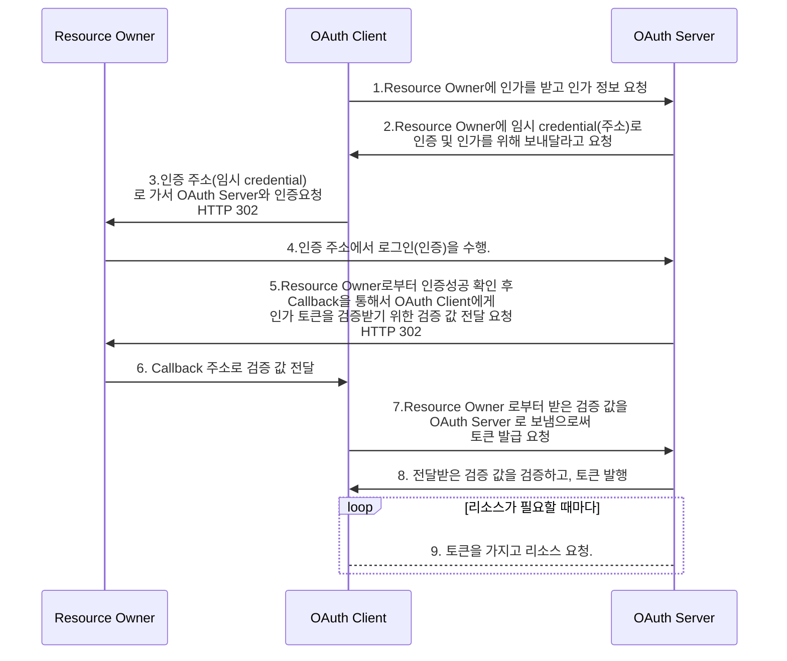
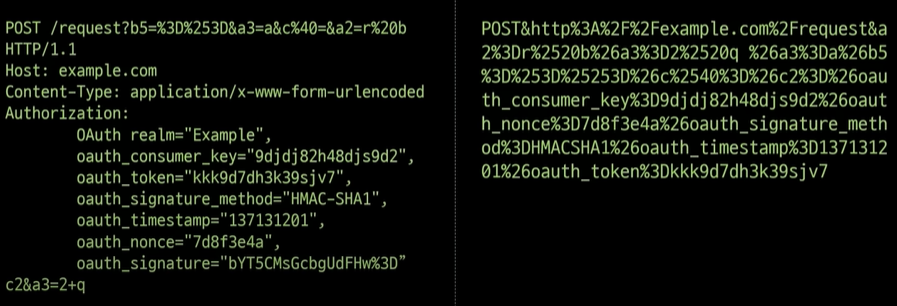

# OAuth

## OAuth 1.0 인가 프로토콜

OAuth 1.0 프로토콜에서는 세가지 역할이 있다.

- Resource Owner : OAuth Client 인가작업을 할 수 있는 자연인
- OAuth Client : Resource Owner의 Resource 에 접근을 해서 활용하려는 어플리케이션
- OAuth Server : Resource Owner로 부터 인증을 하고, OAuth Client에게 인가하는 서버

### OAuth 1.0 프로토콜의 흐름



### OAuth 1.0 의 문제점

OAuth1.0 프로토콜은 사용할수 있는 범위가 적절할까? 또 안전한 프로토콜 일까? OAuth 1.0 프로토콜이 생겨날 당시 환경을 생각하면 단순히 브라우저를 통해서만 웹과 상호작용했을 것이고, 웹 보안이 현재와 비교해서 많이 발전되기 전이다. 이에 따라 현재 웹 환경에서 이 프로토콜을 적용한다면 다음과 같은 문제점이 일어날 것이다.

- Scope 개념 존재 하지 않음
- 역할이 확실히 나누어지지 않음
- 토큰 유효기간 문제
- Client 구현 복잡성
- 제한적인 사용 환경

## OAuth 2.0

OAuth 1.0 은 출시 당시 굉장한 인기를 끌었다. 하지만 이 당시 큰 지원은 없었지만, OAuth 2.0 이 되면서 IETF의 워킹그룹이 생기고 여러가지 대형 엔터프라이즈와 사용처들이 스펙을 정하게 되면서 OAuth 1.0 의 약점을 보완함 으로써 OAuth 2.0을 만들게 되었다.

### OAuth 1.0 에 비해 보안된 점

OAuth 1.0 프로토콜은 위에서 봤듯이 여러가지 문제점이 있다. 이를 OAuth 2.0에서 어떤식으로 약점을 보완했는지 살펴보자.

#### Scope 기능 추가

OAuth1.0 에서 토큰이라는 인가를 나타내는 값만 있었으면 사용자의 모든 리소스를 접근할 수 있었다. 하지만 이 의미는 접근 범위에 대한 명확한 기준이 없다는 의미이고, 이를 명확히 해줄 필요가 있었다.  

#### Client 복잡성 간소화

OAuth1.0은 보안성을 위해서 암호학적 기반 보안책들을 사용했다. 하지만 암호학적 기반 보안을 받기 위해서는 서명을 위한 원문이 필요하다. 이 원문을 만들기 위해선 http method 뿐만 아니라 uri 그리고 여러가지 파라미터가 필요했다. 더나아가 파라미터는 어떤 파라미터를 넣을 것인지 넣지 말아야 할지 그리고 어떤 순서로 정렬할 것인지에 대해 정확한 분류가 필요했다.



위와 같이 간단한 POST요청을 하기위해 OAuth 1.0 클라이언트는 매번 동일하게 오른쪽과 완벽하게 동일한 서명 원문을 만들어 내야만 OAuth 1.0 스펙을 구현 할 수 있었다.

하지만 OAuth 2.0에서는 이를 **Bearer Token + TLS** 를 활용하여 이를 해결하였다. `Bearer Token` 은 가지고 있기만 하더라도 이용 권한이 있음을 인정해주는 토큰을 의미한다. `Bearer Token` 을 소유를 하기만 하더라도 권한을 인정받기 때문에 OAuth 2.0 프로토콜은 TLS, 대표적인 예로 https 통신을 강제하게 된다.

#### Authorization/Resource Server의 선택적 분리

OAuth 1.0에서는 OAuth 1.0 Server가 Resource Owner인증, 인가 토큰 발급, 보호된 리소스 관리를 하였다. 하지만 마지막 보호된 리소스 관리는 앞 두가지 역할(인증, 인가)과 성격이 다르다. 그러므로 OAuth2.0에서는 OAuth 2.0 Authz Server + OAuth2.0 Resource Server로 분리 했다.

#### 토큰 탈취 개선

OAuth1.0에서는 토큰의 유효기간이 6개월 길게는 1년까지 설정하였다. 하지만 이 토큰이 탈취 된다면 지속적으로 긴 기간동안 악용을 할 우려가 있다. 이를 해결하기 위해서 **AccessToken, Refresh Token** 개념을 도입했다. `Access Token`을 통해 리소스에 접근하지만 유효기간을 짧게 가져가고, `Refresh Token`을 이용하여 새로운 토큰을 발급받아서 리소스에 다시 접근할 수있도록 하였다.

#### 제한적인 사용 환경

OAuth 1.0은 프로토콜은 웹 리다이렉트를 적극 활용하였고 이는 웹 브라우저에서 작동하도록 최적화 되어있다. 하지만 요즘은 웹 브라우저 이외에 스마트 기기에서 접근할 수 있는 환경이 생겼고 이 환경에 적용하는데 문제점이  생겼다. 이를 개선하기 위해 **Grant** 라는 개념을 도입했다.

`Grant` 는 여러가지 사용 환경에 대한 플로우를 나타내는 인증 방식이라고 생각하면 된다. OAuth2.0 의 기본 스펙에 추가가 된 `Grant type`은 4가지가 있다.

- Authorization Code
- Implict
- Resource Owner Password Credentials
- Client Credentials

##### Authorization Code

Authorization Code 는 OAuth1.0 프로토콜과 대동소이한 방식으로, 서버 투 서버가 통신이 가능한 상태에서 인증을 한후에 인증 값을 가지고 서버 투 서버 통신을 통해 토큰을 발급받는 방식이다.

```http
POST /token HTTP/1.1
grant_type=authorization_code
&code=....
&redirect_uri=....
```

##### Implict 

웹브라우저에 있는 자바스크립트 기반 클라이언트와 같이 리소스가 제한된 환경에서 복잡한 서버 투 서버 방식을 사용하는 대신 간략하게 로그인 인증 후에 토큰을 발급받는 방식이다.

```http
POST /authorize HTTP/1.1
?response_type=token
&client_id=....
&redirect_uri=....
```

##### Resource Owner Password Credentials

직접적으로 유저 아이디와 비밀번호를 받아 Client 가 요청하는 방식으로 유저가 직접 가지고 있는 기기의 OS 같은 믿을 수 있는 안전한 환경에서 사용하는 방식이다.

```http
POST /token HTTP/1.1
grant_type=password
&username=....
&password=....
```

##### Client Credentials

Resouce Owner와 Client가 동일한 경우일때, 직접적으로 API 호출을 통해 토큰을 발급 받는 형태이다.

```http
POST /token HTTP/1.1
grant_type=client_credentials
```


## Reference

[ [NHN FORWARD 22] 로그인에 사용하는 OAuth : 과거, 현재 그리고 미래](https://www.youtube.com/watch?v=DQFv0AxTEgM)

